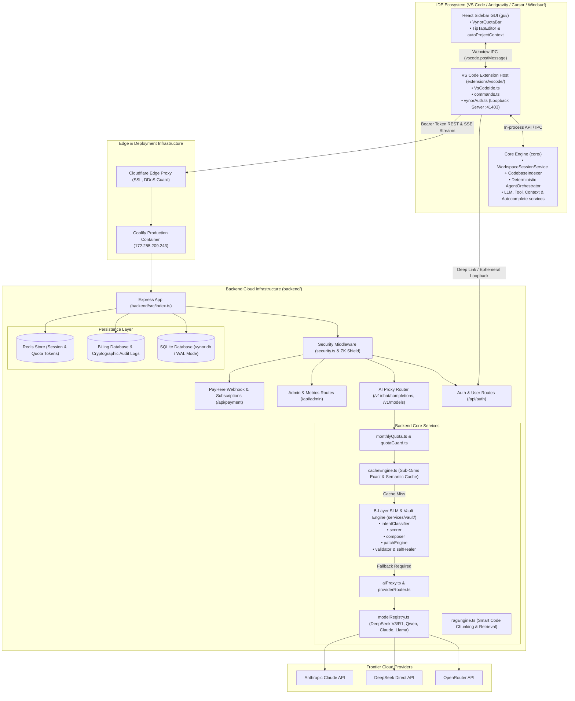
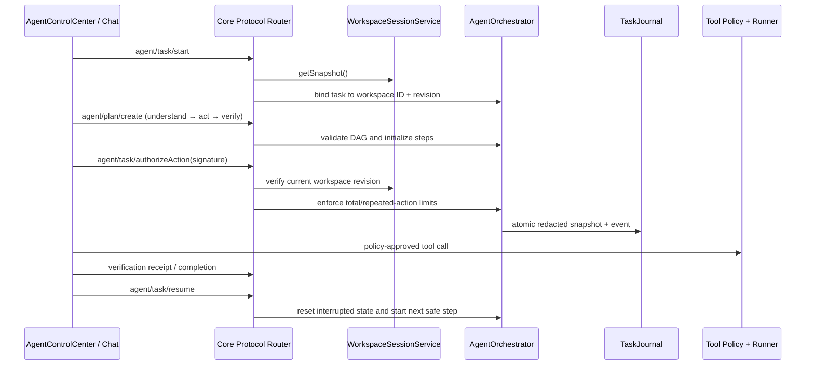

# VynorAI Code Map & Architecture Index

> **Status:** This is the maintained architecture index for the production codebase. Last agent-runtime refresh: 2026-10-02.

---

## 1. High-Level Architecture Overview

VynorAI is a multi-tier AI-assisted developer platform engineered to provide cost-effective frontier AI models, Sri Lankan local payments (via PayHere), and a zero-token deterministic local SLM / Golden Vault engine across multiple IDEs.

---

## 2. Backend Index (`backend/`)

The backend is built with Node.js, Express, and TypeScript (`backend/package.json`), providing authentication, PayHere payment processing, quota enforcement, model proxying, and the deterministic SLM vault.

### 2.1 Entry Points & Server Setup

- [backend/src/index.ts](file:///d:/My%20Project/VynorAI/backend/src/index.ts): Main application entry point. Configures Express, CORS, Cloudflare reverse proxy settings (`trust proxy`), static assets (`login.html`, `admin.html`), clean URL routes, security headers, and mounts sub-routers (`/api/auth`, `/v1`, `/api/admin`, `/api/payment`, `/api/memory`).
- [backend/src/config.ts](file:///d:/My%20Project/VynorAI/backend/src/config.ts): Centralized configuration loader. Manages environment variables, port bindings, JWT secret keys, model aliases (`MODEL_ALIASES`), default models, PayHere merchant keys, and quota tiers.
- [backend/src/db.ts](file:///d:/My%20Project/VynorAI/backend/src/db.ts): Primary database connection manager. Initializes SQLite tables in WAL mode (`users`, `subscriptions`, `api_keys`, `usage_logs`, `transactions`, `ide_auth_codes`) and seeds initial plan configurations.

### 2.2 Middleware

- [backend/src/middleware/security.ts](file:///d:/My%20Project/VynorAI/backend/src/middleware/security.ts): Strict HTTP security middleware setting Content Security Policy (CSP), anti-clickjacking headers, HSTS, cross-origin isolation, and rate-limiting guards.

### 2.3 Route Handlers (`backend/src/routes/`)

- [backend/src/routes/auth.ts](file:///d:/My%20Project/VynorAI/backend/src/routes/auth.ts):
  - User registration, login, and password management.
  - Ephemeral loopback handshake (`/api/auth/ide-exchange`, `/api/auth/ide-token-poll`).
  - Session verification (`/api/auth/me`) and API key regeneration.
- [backend/src/routes/proxy.ts](file:///d:/My%20Project/VynorAI/backend/src/routes/proxy.ts):
  - OpenAI-compatible chat completions proxy endpoint (`/v1/chat/completions`) with SSE streaming support.
  - Dynamic model listing (`/v1/models`) enforcing subscriber plan boundaries.
  - Fill-in-the-Middle (FIM) code autocompletion endpoint (`/v1/completions`).
  - Quick-fix code diagnostics endpoint (`/v1/quick-fix`).
  - Golden template registry and compound scaffolding endpoints (`/v1/templates`, `/v1/scaffolds/catalog`, `/v1/scaffolds/:id`).
  - Cryptographic Merkle chain audit verification endpoint (`/v1/security/merkle-verify`).
- [backend/src/routes/admin.ts](file:///d:/My%20Project/VynorAI/backend/src/routes/admin.ts):
  - Enterprise administration panel endpoints for user management, plan overrides, quota manual adjustments, system logs, and security monitoring.
- [backend/src/routes/payment.ts](file:///d:/My%20Project/VynorAI/backend/src/routes/payment.ts):
  - PayHere payment gateway checkout session creation (`/api/payment/checkout`).
  - MD5 signature validation and PayHere IPN webhook listener (`/api/payment/notify`).
  - Subscription status validation and quota refresh on successful renewal.
- [backend/src/routes/memory.ts](file:///d:/My%20Project/VynorAI/backend/src/routes/memory.ts):
  - Long-term user preferences, project-specific instructions, and memory storage routes.

### 2.4 Core Services (`backend/src/services/`)

#### A. AI Proxy, Routing & Completion

- [backend/src/services/aiProxy.ts](file:///d:/My%20Project/VynorAI/backend/src/services/aiProxy.ts): Master proxy engine orchestrating incoming `/v1/chat/completions` calls. Coordinates API key authentication, secret sanitization, quota reservation, exact/semantic cache inspection, 5-layer SLM delegation, and upstream streaming.
- [backend/src/services/providerRouter.ts](file:///d:/My%20Project/VynorAI/backend/src/services/providerRouter.ts): Upstream provider multiplexer. Routes requests to OpenRouter, DeepSeek direct endpoints, or Anthropic with automatic circuit-breaker fallback.
- [backend/src/services/modelRegistry.ts](file:///d:/My%20Project/VynorAI/backend/src/services/modelRegistry.ts): Single source of truth for available models, plan permissions, display names, context windows, and pricing tier metadata.
- [backend/src/services/tokenOptimizer.ts](file:///d:/My%20Project/VynorAI/backend/src/services/tokenOptimizer.ts): Compresses repetitive conversation history, trims whitespace, and optimizes tokens before reaching frontier providers.
- [backend/src/services/fimEngine.ts](file:///d:/My%20Project/VynorAI/backend/src/services/fimEngine.ts): Ultra-low-latency Fill-in-the-Middle engine tailored for IDE tab autocompletions.
- [backend/src/services/quickFixEngine.ts](file:///d:/My%20Project/VynorAI/backend/src/services/quickFixEngine.ts): Fast diagnostic and lint error solver responding with targeted surgical code diffs.
- [backend/src/services/hybridContext.ts](file:///d:/My%20Project/VynorAI/backend/src/services/hybridContext.ts): Merges workspace AST symbols, local files, and user intent into high-density context windows.

#### B. 5-Layer Deterministic SLM & Golden Vault (`backend/src/services/vault/`)

- [backend/src/services/vault/orchestrator.ts](file:///d:/My%20Project/VynorAI/backend/src/services/vault/orchestrator.ts): Coordinates the 5-layer deterministic pipeline; achieves 0-token cost and sub-15ms latency when requests match known patterns.
- [backend/src/services/vault/intentClassifier.ts](file:///d:/My%20Project/VynorAI/backend/src/services/vault/intentClassifier.ts): **Layer 1** — Classifies prompts using token trees, regex AST, and keywords to identify deterministic solutions.
- [backend/src/services/vault/scorer.ts](file:///d:/My%20Project/VynorAI/backend/src/services/vault/scorer.ts): **Layer 2** — Calculates confidence score ($S \in [0, 1]$). Threshold $\ge 0.85$ triggers local vault generation; otherwise safely defers to cloud LLMs.
- [backend/src/services/vault/composer.ts](file:///d:/My%20Project/VynorAI/backend/src/services/vault/composer.ts): **Layer 3** — Injects and adapts production-tested Golden Templates.
- [backend/src/services/vault/patchEngine.ts](file:///d:/My%20Project/VynorAI/backend/src/services/vault/patchEngine.ts): **Layer 4** — Generates surgical search/replace diff blocks (`<<<<<<< SEARCH ... ======= ... >>>>>>>`) instead of regenerating entire files.
- [backend/src/services/vault/validator.ts](file:///d:/My%20Project/VynorAI/backend/src/services/vault/validator.ts) & [databaseGuardrails.ts](file:///d:/My%20Project/VynorAI/backend/src/services/vault/databaseGuardrails.ts): **Layer 5** — Verifies syntax correctness, validates against SQL injections, and ensures no credential leakage.
- [backend/src/services/vault/selfHealer.ts](file:///d:/My%20Project/VynorAI/backend/src/services/vault/selfHealer.ts): Autonomous healing loop that fixes syntax or import discrepancies in generated scaffolds.
- [backend/src/services/templateVault.ts](file:///d:/My%20Project/VynorAI/backend/src/services/templateVault.ts): Pre-vetted golden templates (PayHere hash generation, NIC validation, E.164 phone formats, JWT authentication workflows).
- [backend/src/services/scaffoldRegistry.ts](file:///d:/My%20Project/VynorAI/backend/src/services/scaffoldRegistry.ts): Multi-file compound scaffold registry for rapid full-stack project generation.
- [backend/src/services/vaultStore.ts](file:///d:/My%20Project/VynorAI/backend/src/services/vaultStore.ts): Persistent metadata storage and categorization for dynamic template discovery.

#### C. Billing, Quota & Financial Operations

- [backend/src/services/monthlyQuota.ts](file:///d:/My%20Project/VynorAI/backend/src/services/monthlyQuota.ts): Atomic token quota reservation, deduction, and monthly billing cycle reset manager.
- [backend/src/services/quotaGuard.ts](file:///d:/My%20Project/VynorAI/backend/src/services/quotaGuard.ts): Fast in-memory quota guard rejecting requests if user balance is exhausted.
- [backend/src/services/billingDb.ts](file:///d:/My%20Project/VynorAI/backend/src/services/billingDb.ts): Dedicated billing database connector supporting transaction atomicity and Merkle tree hash auditing.
- [backend/src/services/payhere.ts](file:///d:/My%20Project/VynorAI/backend/src/services/payhere.ts): PayHere payment hash calculation, currency normalization (LKR), and notification signature verification.
- [backend/src/services/planManager.ts](file:///d:/My%20Project/VynorAI/backend/src/services/planManager.ts): Definitions and state transitions for subscription tiers: Free, Starter, Pro, and Ultra.
- [backend/src/services/costLedger.ts](file:///d:/My%20Project/VynorAI/backend/src/services/costLedger.ts): Calculates gross margin metrics, tracking tokens billed vs. tokens saved via deterministic SLM.

#### D. Security & Privacy

- [backend/src/services/secretSanitizer.ts](file:///d:/My%20Project/VynorAI/backend/src/services/secretSanitizer.ts): Scans and redacts AWS keys, private RSA/SSH keys, GitHub tokens, and sensitive credentials before prompts leave the server.
- [backend/src/services/zkShield.ts](file:///d:/My%20Project/VynorAI/backend/src/services/zkShield.ts): Zero-Knowledge privacy shield ensuring prompt bodies are anonymized.
- [backend/src/services/securityAudit.ts](file:///d:/My%20Project/VynorAI/backend/src/services/securityAudit.ts): Records and analyzes suspicious patterns or prompt-injection attempts.
- [backend/src/services/credentialVault.ts](file:///d:/My%20Project/VynorAI/backend/src/services/credentialVault.ts): Encrypted storage for external service credentials and keys.

#### E. Cache, Retrieval & Auxiliary

- [backend/src/services/cacheEngine.ts](file:///d:/My%20Project/VynorAI/backend/src/services/cacheEngine.ts): SQLite/in-memory cache for recurring exact prompts and high-similarity completions.
- [backend/src/services/redisStore.ts](file:///d:/My%20Project/VynorAI/backend/src/services/redisStore.ts): Optional Redis caching and distributed state layer.
- [backend/src/services/ragEngine.ts](file:///d:/My%20Project/VynorAI/backend/src/services/ragEngine.ts): Semantic code chunker and TF-IDF search engine extracting context from open workspace files.
- [backend/src/services/memoryEngine.ts](file:///d:/My%20Project/VynorAI/backend/src/services/memoryEngine.ts): Persistent developer memory store across sessions.
- [backend/src/services/healthMonitor.ts](file:///d:/My%20Project/VynorAI/backend/src/services/healthMonitor.ts): Background health check service monitoring API latencies, SQLite connection state, and provider uptime.
- [backend/src/services/circuitBreaker.ts](file:///d:/My%20Project/VynorAI/backend/src/services/circuitBreaker.ts): Protects against cascading failures from slow or failing external LLM providers.
- [backend/src/services/ideAuthCodes.ts](file:///d:/My%20Project/VynorAI/backend/src/services/ideAuthCodes.ts): Generates and tracks short-lived cryptographically random codes for IDE authentication.
- [backend/src/services/webSearch.ts](file:///d:/My%20Project/VynorAI/backend/src/services/webSearch.ts): Web search query integration for real-time documentation retrieval.
- [backend/src/services/emailService.ts](file:///d:/My%20Project/VynorAI/backend/src/services/emailService.ts): Sends transactional onboarding, password reset, and receipt emails via Nodemailer.

---

## 3. Extension Index (`extensions/vscode/`)

The VS Code extension represents the primary IDE client interface for VynorAI, integrating chat, autocomplete, quick-edit, terminal debugging, and authentication.

### 3.1 Extension Manifest & Configuration

- [extensions/vscode/package.json](file:///d:/My%20Project/VynorAI/extensions/vscode/package.json):
  - Extension identity: `vynorai.vynorai` (v1.1.0).
  - Activation events: `onUri`, `onStartupFinished`, `onView:continueGUIView`.
  - Contributed commands: `continue.focusContinueInput`, `continue.focusEdit`, `continue.acceptDiff`, `continue.rejectDiff`, `continue.toggleTabAutocompleteEnabled`, etc.
  - Keybindings: `Ctrl+L` / `Cmd+L` (Focus Chat), `Ctrl+I` / `Cmd+I` (Quick Edit), `Ctrl+Shift+R` (Debug Terminal).
  - View containers: Sidebar activity bar (`continue`) and bottom console panel (`continueConsole`).

### 3.2 Core Extension Lifecycle & Webview Providers

- [extensions/vscode/src/extension.ts](file:///d:/My%20Project/VynorAI/extensions/vscode/src/extension.ts): Main activation entry point. Registers commands, starts the IDE bridge, initializes authentication, and launches webviews.
- [extensions/vscode/src/ContinueGUIWebviewViewProvider.ts](file:///d:/My%20Project/VynorAI/extensions/vscode/src/ContinueGUIWebviewViewProvider.ts): Manages the webview lifecycle for the React sidebar GUI. Handles HTML injection, CSP policies, and bidirectional IPC messaging.
- [extensions/vscode/src/ContinueConsoleWebviewViewProvider.ts](file:///d:/My%20Project/VynorAI/extensions/vscode/src/ContinueConsoleWebviewViewProvider.ts): Manages the bottom panel console webview for raw LLM request/response inspection and debugging.
- [extensions/vscode/src/VsCodeIde.ts](file:///d:/My%20Project/VynorAI/extensions/vscode/src/VsCodeIde.ts): Implements the core `IDE` interface for VS Code. Provides workspace file reading, diff application, terminal execution, diagnostics retrieval, and configuration reading.
- [extensions/vscode/src/commands.ts](file:///d:/My%20Project/VynorAI/extensions/vscode/src/commands.ts): Implements handlers for all registered VS Code commands (e.g., applying code from chat, generating comments, running codebase re-indexing).
- [extensions/vscode/src/suggestions.ts](file:///d:/My%20Project/VynorAI/extensions/vscode/src/suggestions.ts): Inline editor code lenses and context suggestion triggers.
- [extensions/vscode/src/webviewProtocol.ts](file:///d:/My%20Project/VynorAI/extensions/vscode/src/webviewProtocol.ts): Strongly-typed bidirectional messaging protocol between the extension host and the GUI webview.

### 3.3 Vynor Authentication & Integration Utilities (`extensions/vscode/src/util/`)

- [extensions/vscode/src/util/vynorAuth.ts](file:///d:/My%20Project/VynorAI/extensions/vscode/src/util/vynorAuth.ts): **Multi-IDE Ephemeral Loopback & Deep Link Handler**:
  - Launches local loopback HTTP server on port `41403` to automatically capture browser OAuth logins.
  - Registers custom URI handlers for `vscode://vynorai.vynorai/auth`, `antigravity://vynorai.vynorai/auth`, and `cursor://vynorai.vynorai/auth`.
  - Securely stores authentication tokens using VS Code `SecretStorage`.
  - Automatically provisions `~/.continue/config.json` and `config.yaml` to point to VynorAI endpoints.
- [extensions/vscode/src/util/ideUtils.ts](file:///d:/My%20Project/VynorAI/extensions/vscode/src/util/ideUtils.ts): Utilities for interacting with editor windows, active documents, visible ranges, and selections.
- [extensions/vscode/src/util/battery.ts](file:///d:/My%20Project/VynorAI/extensions/vscode/src/util/battery.ts): Battery level monitor pausing tab autocompletions when laptop battery is low.
- [extensions/vscode/src/util/cleanSlate.ts](file:///d:/My%20Project/VynorAI/extensions/vscode/src/util/cleanSlate.ts): Cleans corrupt cache and temporary files upon upgrade or reset.
- [extensions/vscode/src/util/getTheme.ts](file:///d:/My%20Project/VynorAI/extensions/vscode/src/util/getTheme.ts): Extracts active VS Code theme colors and syntax tokens to ensure GUI styling matches the IDE theme.

### 3.4 Functional Submodules

- `extensions/vscode/src/autocomplete/`: Tab autocomplete provider using VS Code `InlineCompletionItemProvider`. Implements debounce, caching, and multiline ghost text.
- `extensions/vscode/src/quickEdit/`: Interactive natural language editing session (`Ctrl+I` / `Cmd+I`) displaying floating input boxes and inline stream changes.
- `extensions/vscode/src/diff/`: Vertical diff provider rendering unified and side-by-side diff blocks with Accept/Reject action buttons.
- `extensions/vscode/src/terminal/`: Terminal capture and debug runner enabling AI error analysis on terminal commands.
- `extensions/vscode/src/lang-server/`: Integration with standard Language Server Protocol (LSP) for symbol definition and diagnostics.
- `extensions/vscode/src/checkpoints/`: Local file checkpointing and automatic rollback history.

### 3.5 Other Extension Targets

- `extensions/cli/`: Headless command-line interface implementation for VynorAI.
- `extensions/intellij/`: JetBrains IntelliJ platform plugin bridge.

---

## 4. Frontend GUI Index (`gui/`)

The frontend is a React + Vite + TypeScript application rendered inside the IDE webview sidebar.

### 4.1 Entry Points & Shell

- [gui/src/main.tsx](file:///d:/My%20Project/VynorAI/gui/src/main.tsx): Webview entry point configuring React 18 root, Redux Provider, and theme listeners.
- [gui/src/App.tsx](file:///d:/My%20Project/VynorAI/gui/src/App.tsx): Root layout rendering navigation bar, top notifications, the active page (Chat, History, Settings), and the persistent Vynor quota bar.
- [gui/src/console.tsx](file:///d:/My%20Project/VynorAI/gui/src/console.tsx): Standalone entry point for the bottom panel debug console.

### 4.2 Vynor UI Components & Features (`gui/src/components/`)

- [gui/src/components/VynorQuotaBar.tsx](file:///d:/My%20Project/VynorAI/gui/src/components/VynorQuotaBar.tsx): Real-time quota indicator displaying:
  - Remaining monthly tokens and tier badge (Free, Starter, Pro, Ultra).
  - Preserved token metrics achieved via local SLM and cache.
  - Direct links to Sri Lankan Rupee (LKR) top-up and upgrade checkout.
- [gui/src/components/mainInput/TipTapEditor/utils/autoProjectContext.ts](file:///d:/My%20Project/VynorAI/gui/src/components/mainInput/TipTapEditor/utils/autoProjectContext.ts): Intelligent prompt analyzer detecting architectural / project queries (`repo`, `codebase`, `architecture`) and automatically attaching workspace context trees without requiring manual `@codebase` tags.
- [gui/src/components/AgentWorkspace/AgentControlCenter.tsx](file:///d:/My%20Project/VynorAI/gui/src/components/AgentWorkspace/AgentControlCenter.tsx): Responsive runtime control surface showing the persisted plan, step state, progress, autonomous-action budget, verification suggestions, cancellation, and same-session task resume.
- `gui/src/components/mainInput/`: Rich chat input editor built with TipTap, supporting slash commands (`/edit`, `/test`), context pill attachments (`@file`, `@codebase`), and model selectors.

### 4.3 State Management & Hooks

- `gui/src/redux/`: Redux Toolkit store and state slices:
  - `sessionSlice`: Current chat session, message history, streaming tokens.
  - `configSlice`: User settings, model configurations, selected providers.
  - `uiStateSlice`: Sidebar toggle states, active tabs, dialogs.
- `gui/src/context/`: Context providers for IDE messaging (`VScodeMessenger`) and theme synchronization.
- `gui/src/hooks/`: Custom React hooks for keyboard navigation, streaming text decoding, and debounce.

---

## 5. Core Engine Index (`core/`)

The `core/` package is the platform-agnostic TypeScript core shared between the VS Code extension, CLI, and standalone binaries.

### 5.1 Orchestration, Protocol & Agent Runtime

- [core/core.ts](file:///d:/My%20Project/VynorAI/core/core.ts): Central core orchestrator. Dispatches IPC messages, coordinates streaming chat responses, manages sessions, and binds workspace actions:
  - **`workspace/getVerificationPlan`**: Dynamically binds `VerificationDiscovery` to active workspace snapshots.
  - **`agent/task/resume`**: Autonomous task execution progression using `agentOrchestrator.next()` and `startStep()`.
- [core/protocol/core.ts](file:///d:/My%20Project/VynorAI/core/protocol/core.ts): Comprehensive schema and type definitions defining IPC messages, IDE actions, tool calls, and model configs:
  - Added typed contract `workspace/getVerificationPlan: [undefined, VerificationCommandCandidate[]]`.
- [core/workspace/types.ts](file:///d:/My%20Project/VynorAI/core/workspace/types.ts): Workspace snapshot, root directory, and manifest interfaces:
  - Added `VerificationCommandCandidate` interface (`id`, `rootId`, `rootName`, `kind: "test" | "typecheck" | "lint" | "build"`, `command`, `source`, `confidence`, `requiresApproval: true`).
- [core/workspace/WorkspaceSessionService.ts](file:///d:/My%20Project/VynorAI/core/workspace/WorkspaceSessionService.ts): Builds privacy-safe workspace identity snapshots. Absolute roots stay inside core; the GUI receives root IDs, relative artifact names, digests, trust, branch, index state, and a monotonic revision.
- [core/agent/AgentOrchestrator.ts](file:///d:/My%20Project/VynorAI/core/agent/AgentOrchestrator.ts): Validates acyclic plans, gates risky steps, bounds retries, binds execution to workspace revisions, detects repeated tool loops, enforces the 24-action budget, and controls cancellation/resume.
- [core/agent/TaskRuntime.ts](file:///d:/My%20Project/VynorAI/core/agent/TaskRuntime.ts): Mutex-serialized task, token-budget, approval, and verification state mutations.
- [core/agent/TaskJournal.ts](file:///d:/My%20Project/VynorAI/core/agent/TaskJournal.ts): Permission-restricted atomic task snapshots and append-only events. Persisted values are redacted; raw prompts and tool arguments are represented by digests.

### 5.2 Agent Verification & Tool Execution (`core/agent/`)

- [core/agent/VerificationDiscovery.ts](file:///d:/My%20Project/VynorAI/core/agent/VerificationDiscovery.ts): **Autonomous Workspace Verification Discovery Engine**:
  - Automatically identifies test, typecheck, lint, and build commands across workspaces.
  - Detects package managers (`npm`, `pnpm`, `yarn`, `bun`) via lockfile inspection (`pnpm-lock.yaml`, `yarn.lock`, `bun.lockb`) or `packageManager` field in `package.json`.
  - Parses multi-language manifests: `package.json`, `Cargo.toml`, `go.mod`, `pom.xml`, `build.gradle`, `build.gradle.kts`, `composer.json`, `Gemfile`, `pyproject.toml`, and `requirements.txt`.
  - Security model: Untrusted repository scripts enforce `requiresApproval: true`, SHA-256 deduplicated IDs, and top-12 candidate limits.
- [core/agent/VerificationDiscovery.vitest.ts](file:///d:/My%20Project/VynorAI/core/agent/VerificationDiscovery.vitest.ts): Unit tests validating script priority, malformed-manifest handling, approval flags, and prevention of script-body leakage.
- [core/agent/types.ts](file:///d:/My%20Project/VynorAI/core/agent/types.ts): Canonical task, plan, approval, verification, budget, and execution-guard types shared by core and GUI.

### 5.3 Agent Runtime Flow

### 5.4 Codebase Indexing Pipeline (`core/indexing/`)

- [core/indexing/CodebaseIndexer.ts](file:///d:/My%20Project/VynorAI/core/indexing/CodebaseIndexer.ts): Master indexing coordinator. Computes file diffs, git branch tags, and orchestrates incremental indexing.
- [core/indexing/CodeSnippetsIndex.ts](file:///d:/My%20Project/VynorAI/core/indexing/CodeSnippetsIndex.ts): Uses Tree-sitter AST queries to index functions, classes, and top-level definitions across multiple languages.
- [core/indexing/FullTextSearchCodebaseIndex.ts](file:///d:/My%20Project/VynorAI/core/indexing/FullTextSearchCodebaseIndex.ts): High-speed full-text search index powered by SQLite FTS5.
- [core/indexing/LanceDbIndex.ts](file:///d:/My%20Project/VynorAI/core/indexing/LanceDbIndex.ts): Vector database embeddings index powered by LanceDB for semantic retrieval.
- [core/indexing/walkDir.ts](file:///d:/My%20Project/VynorAI/core/indexing/walkDir.ts): Fast directory traversal utility respecting gitignore and continueignore rules.
- [core/indexing/ignore.ts](file:///d:/My%20Project/VynorAI/core/indexing/ignore.ts): Evaluates ignore patterns (`.gitignore`, `.continueignore`) to prevent indexing build output, secrets, or large binary files.
- [core/indexing/refreshIndex.ts](file:///d:/My%20Project/VynorAI/core/indexing/refreshIndex.ts): Incremental re-indexer triggered on file save or branch change.

### 5.5 LLM Drivers & Context Providers

- [core/llm/llms/VynorAI.ts](file:///d:/My%20Project/VynorAI/core/llm/llms/VynorAI.ts): **Native VynorAI Cloud LLM Provider Driver**:
  - Subclasses `OpenAI` provider, passing `X-VynorAI-Client` and `X-VynorAI-Version: 2.0.0` headers.
  - Automatically targets `https://vynor.lk/v1/` endpoint with Bearer auth.
  - Custom stream interceptor (`_streamChat`) catching `403` / `429` quota limits to render interactive Sri Lankan Rupee (LKR) plan upgrade prompts.
- `core/llm/`: Unified provider interfaces and adapters for OpenAI, Anthropic, DeepSeek, Ollama, Gemini, and custom proxies.
- `core/context/`: Modular context providers implementing `@file`, `@codebase`, `@folder`, `@docs`, `@terminal`, `@diff`, and `@git`.
- `core/autocomplete/`: Autocomplete formatting, multiline heuristic filters, and prompt template construction.
- `core/nextEdit/`: Predictive next edit suggestion engine.

---

## 6. Shared Packages, Native Modules & Utilities

### 6.1 Shared Packages (`packages/`)

- [packages/config-types/](file:///d:/My%20Project/VynorAI/packages/config-types): TypeScript interfaces and JSON Schema definitions for `config.json` and `config.yaml`.
- [packages/config-yaml/](file:///d:/My%20Project/VynorAI/packages/config-yaml): Serializer and validator for YAML-based IDE configurations.
- [packages/fetch/](file:///d:/My%20Project/VynorAI/packages/fetch): HTTP fetch abstraction with corporate proxy support, SSL cert handling, and retry mechanics.
- [packages/llm-info/](file:///d:/My%20Project/VynorAI/packages/llm-info): Comprehensive catalog of LLMs, context window limits, token ratios, and model attributes.
- [packages/openai-adapters/](file:///d:/My%20Project/VynorAI/packages/openai-adapters): Adapters mapping proprietary model protocols into standardized OpenAI payloads.
- [packages/terminal-security/](file:///d:/My%20Project/VynorAI/packages/terminal-security): Validates and sanitizes terminal commands to prevent execution of hazardous shell scripts.

### 6.2 Standalone Binary & Native Acceleration

- [binary/](file:///d:/My%20Project/VynorAI/binary): Headless Node.js packaging bundle allowing the core engine to execute as a standalone process for non-VS Code clients.
- [sync/](file:///d:/My%20Project/VynorAI/sync): High-performance Rust crate compiled to `sync.node` using `napi-rs` for ultra-fast file watching, AST parsing, and workspace synchronization.

### 6.3 Scripts & Scratch Tools (`scripts/` & `scratch/`)

- [scripts/](file:///d:/My%20Project/VynorAI/scripts): Packaging, build, and CI/CD automation scripts (`esbuild.js`, `package.js`, `release-smoke.mjs`).
- [scratch/](file:///d:/My%20Project/VynorAI/scratch): End-to-end integration and verification scripts:
  - `test_vault_healer.js`: Tests the deterministic SLM self-healer and template composer.
  - `test_live_opensaas.js`: End-to-end cloud completion test against live endpoints.
  - `test_speedpy_vault.js`: Latency benchmarks comparing deterministic SLM vs. cloud LLM calls.

---

## 7. Cross-Component Communication Matrix

| Source                   | Destination               | Protocol / Transport                        | Purpose                                                                                |
| :----------------------- | :------------------------ | :------------------------------------------ | :------------------------------------------------------------------------------------- |
| **Browser OAuth**        | **Extension Host**        | HTTP `127.0.0.1:41403` / URI Scheme         | Transmits auth tokens from web portal to IDE                                           |
| **GUI Webview**          | **Extension Host**        | `vscode.postMessage` / typed IPC            | Chat inputs, settings updates, diff decisions                                          |
| **Extension Host**       | **Core Engine**           | In-Process TypeScript API / Stream          | Prompt evaluation, indexing queries, tool executions                                   |
| **Agent Control Center** | **AgentOrchestrator**     | Typed `agent/task/*` and `agent/plan/*` IPC | Plan progress, safety budgets, cancellation, and resumable execution                   |
| **Verification UI**      | **VerificationDiscovery** | `workspace/getVerificationPlan` IPC         | Approval-required test/typecheck/lint/build suggestions without exposing script bodies |
| **Extension Host**       | **Backend Proxy**         | HTTPS REST / SSE Stream                     | Chat completions, FIM autocompletions, model lists                                     |
| **Extension Host**       | **Backend Auth**          | HTTPS REST (`/api/auth/*`)                  | Token exchange, session polling, subscription query                                    |
| **Backend Proxy**        | **Upstream LLMs**         | HTTPS REST / Streaming                      | Forwards cache-miss prompts to DeepSeek/OpenRouter                                     |
| **Core Indexer**         | **Local DBs**             | SQLite FTS5 / LanceDB                       | Persistent vector and keyword search indices                                           |

---

## 8. Quick Reference Index by Capability

| Capability                               | Primary Source Files                                                                                                                                                                                                                                                                                                                                                                                                                                                   |
| :--------------------------------------- | :--------------------------------------------------------------------------------------------------------------------------------------------------------------------------------------------------------------------------------------------------------------------------------------------------------------------------------------------------------------------------------------------------------------------------------------------------------------------- |
| **Backend Server & Routes**              | [backend/src/index.ts](file:///d:/My%20Project/VynorAI/backend/src/index.ts), [proxy.ts](file:///d:/My%20Project/VynorAI/backend/src/routes/proxy.ts), [auth.ts](file:///d:/My%20Project/VynorAI/backend/src/routes/auth.ts), [payment.ts](file:///d:/My%20Project/VynorAI/backend/src/routes/payment.ts)                                                                                                                                                              |
| **Deterministic 5-Layer SLM**            | [orchestrator.ts](file:///d:/My%20Project/VynorAI/backend/src/services/vault/orchestrator.ts), [intentClassifier.ts](file:///d:/My%20Project/VynorAI/backend/src/services/vault/intentClassifier.ts), [scorer.ts](file:///d:/My%20Project/VynorAI/backend/src/services/vault/scorer.ts), [templateVault.ts](file:///d:/My%20Project/VynorAI/backend/src/services/templateVault.ts)                                                                                     |
| **Quota & PayHere Billing**              | [monthlyQuota.ts](file:///d:/My%20Project/VynorAI/backend/src/services/monthlyQuota.ts), [billingDb.ts](file:///d:/My%20Project/VynorAI/backend/src/services/billingDb.ts), [payhere.ts](file:///d:/My%20Project/VynorAI/backend/src/services/payhere.ts)                                                                                                                                                                                                              |
| **Extension Host & Auth**                | [extension.ts](file:///d:/My%20Project/VynorAI/extensions/vscode/src/extension.ts), [vynorAuth.ts](file:///d:/My%20Project/VynorAI/extensions/vscode/src/util/vynorAuth.ts), [VsCodeIde.ts](file:///d:/My%20Project/VynorAI/extensions/vscode/src/VsCodeIde.ts)                                                                                                                                                                                                        |
| **Frontend GUI, Agent Control & Quota**  | [Chat.tsx](file:///d:/My%20Project/VynorAI/gui/src/pages/gui/Chat.tsx), [AgentControlCenter.tsx](file:///d:/My%20Project/VynorAI/gui/src/components/AgentWorkspace/AgentControlCenter.tsx), [VynorQuotaBar.tsx](file:///d:/My%20Project/VynorAI/gui/src/components/VynorQuotaBar.tsx), [autoProjectContext.ts](file:///d:/My%20Project/VynorAI/gui/src/components/mainInput/TipTapEditor/utils/autoProjectContext.ts)                                                  |
| **Codebase Indexing & Search**           | [CodebaseIndexer.ts](file:///d:/My%20Project/VynorAI/core/indexing/CodebaseIndexer.ts), [CodeSnippetsIndex.ts](file:///d:/My%20Project/VynorAI/core/indexing/CodeSnippetsIndex.ts), [FullTextSearchCodebaseIndex.ts](file:///d:/My%20Project/VynorAI/core/indexing/FullTextSearchCodebaseIndex.ts)                                                                                                                                                                     |
| **Native Acceleration**                  | [sync/Cargo.toml](file:///d:/My%20Project/VynorAI/sync/Cargo.toml), [binary/build.js](file:///d:/My%20Project/VynorAI/binary/build.js)                                                                                                                                                                                                                                                                                                                                 |
| **Agent Runtime, Resume & Verification** | [AgentOrchestrator.ts](file:///d:/My%20Project/VynorAI/core/agent/AgentOrchestrator.ts), [TaskRuntime.ts](file:///d:/My%20Project/VynorAI/core/agent/TaskRuntime.ts), [TaskJournal.ts](file:///d:/My%20Project/VynorAI/core/agent/TaskJournal.ts), [VerificationDiscovery.ts](file:///d:/My%20Project/VynorAI/core/agent/VerificationDiscovery.ts), [AgentControlCenter.tsx](file:///d:/My%20Project/VynorAI/gui/src/components/AgentWorkspace/AgentControlCenter.tsx) |
| **VynorAI Native LLM Provider**          | [VynorAI.ts](file:///d:/My%20Project/VynorAI/core/llm/llms/VynorAI.ts), [providerRouter.ts](file:///d:/My%20Project/VynorAI/backend/src/services/providerRouter.ts)                                                                                                                                                                                                                                                                                                    |
| **Scaffolds & Vault Store**              | [scaffoldRegistry.ts](file:///d:/My%20Project/VynorAI/backend/src/services/scaffoldRegistry.ts), [vaultStore.ts](file:///d:/My%20Project/VynorAI/backend/src/services/vaultStore.ts)                                                                                                                                                                                                                                                                                   |

---

## 9. Continue Upstream Boundary

VynorAI is an independent product built from a pinned Continue-derived foundation. The production repository is `origin`; `upstream` is reference-only and must not be merged directly into a release branch.

- Vynor-owned behavior belongs in `core/agent/`, `core/workspace/`, `gui/src/components/AgentWorkspace/`, the Vynor provider/auth modules, and `backend/`.
- Continue security or compatibility updates are selected explicitly, applied on a temporary integration branch, and accepted only after Core, GUI, extension, packaging, and Antigravity smoke gates pass.
- IDE-specific behavior must remain behind protocol or IDE adapters. Cloud billing, quota, agent policy, task persistence, and Vynor UI must not depend on an upstream release schedule.
- Existing direct changes to shared chat/core files are migration seams. New Vynor functionality should prefer dedicated modules with small typed integration points rather than additional embedded forks.
