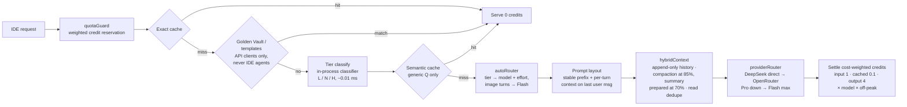
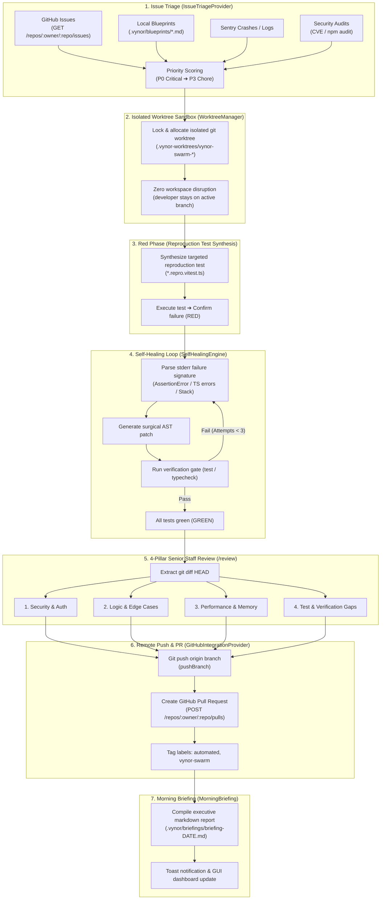
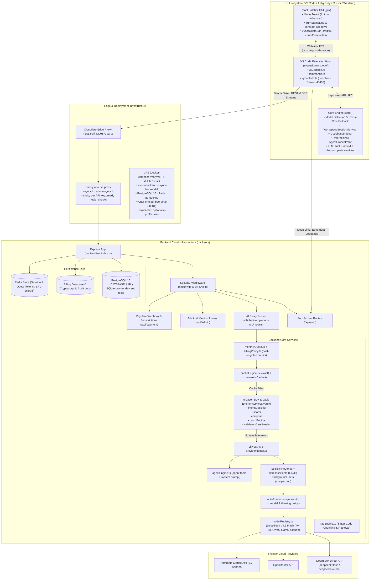
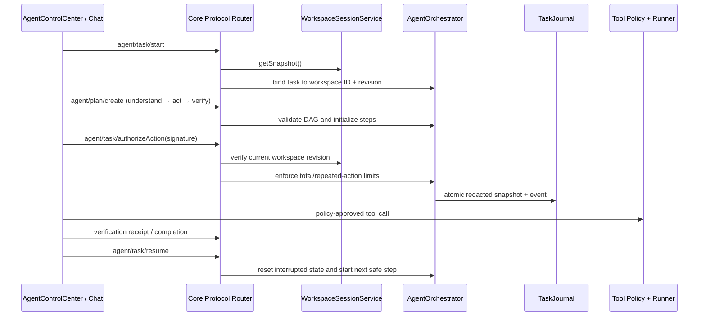

# VynorAI Code Map & Architecture Index

<!-- Competitive gap roadmap vs Claude Code / Codex: docs/VYNORAI_COMPETITIVE_ROADMAP.md -->

> **Status:** This is the maintained architecture index for the production codebase. Last refresh: 2026-10-07 (Production VSIX Offline Extension Packaging & React Webview Bundle Sync, AST-Aware Cross-File Refactoring Engine, Git Worktree Isolation Sandbox Engine, Codebase Symbol Graph Indexer, Autonomous Terminal Self-Healing Loop, Multi-File Speculative Diff Engine, Enterprise Air-Gapped Zero-Knowledge Mode, PayHere Subscription Engine, Cloud GitHub Integration Provider, Redis admission control backpressure, Tree-Sitter dynamic grammars, PostgreSQL system of record, two backend workers behind Caddy).

---

## 1. High-Level Architecture Overview

VynorAI is a multi-tier AI coding platform: an IDE extension (VS Code, Antigravity, Cursor, Windsurf, JetBrains, CLI) backed by a metered cloud proxy. It provides cost-optimized frontier models (DeepSeek V4.1 Flash by default), Sri Lankan payments (PayHere, LKR), a zero-token deterministic Golden Vault engine, with request tiers picked by an in-process classifier. Background jobs (conversation compaction) run on DeepSeek Flash or, when configured, a GPU server (`backgroundLlm.ts`).

### 1.1 Request pipeline (`/v1/chat/completions`)

### 1.2 The Perfection Loop (Autonomous CI/CD & Self-Healing Architecture)

VynorAI executes background autonomous engineering through the **Perfection Loop**—a zero-disruption TDD lifecycle that inspects, reproduces, heals, reviews, and delivers production-grade code without human developer intervention:

---

## 2. Backend Index (`backend/`)

The backend is built with Node.js, Express, and TypeScript (`backend/package.json`), providing authentication, PayHere payment processing, quota enforcement, model proxying, the deterministic SLM vault, and the local SLM router.

### 2.1 Entry Points & Server Setup

- [backend/src/index.ts](file:///d:/My%20Project/VynorAI/backend/src/index.ts): Main application entry point. Configures Express, CORS, Cloudflare reverse proxy settings (`trust proxy`), static assets (`login.html`, `admin.html`), clean URL routes, security headers, and mounts sub-routers (`/api/auth`, `/v1`, `/api/admin`, `/api/payment`, `/api/memory`).
- [backend/src/config.ts](file:///d:/My%20Project/VynorAI/backend/src/config.ts): Centralized configuration loader. Manages environment variables, port bindings, JWT secret keys, model aliases (`MODEL_ALIASES`), default models, PayHere merchant keys, quota tiers, and the tier router mode (`ROUTER_MODE=classifier|slm|rules`, optional `LOCAL_SLM_*`). Background LLM jobs read `LOCAL_LLM_URL`, `LOCAL_LLM_MODEL`, `LOCAL_LLM_ROLES`.
- [backend/src/db.ts](file:///d:/My%20Project/VynorAI/backend/src/db.ts): Database layer. With `DATABASE_URL` it runs on PostgreSQL (`services/pgDriver.ts`, migrations in `services/postgresSchema.ts` under an advisory lock); without it, SQLite (dev and tests). On SIGTERM the server drains: `/ready` returns 503 and in-flight streams get up to 60s.

### 2.2 Middleware

- [backend/src/middleware/security.ts](file:///d:/My%20Project/VynorAI/backend/src/middleware/security.ts): Strict HTTP security middleware setting Content Security Policy (CSP), anti-clickjacking headers, HSTS, cross-origin isolation, and rate-limiting guards.

### 2.3 Route Handlers (`backend/src/routes/`)

- [backend/src/routes/auth.ts](file:///d:/My%20Project/VynorAI/backend/src/routes/auth.ts):
  - User registration, login, and password management.
  - Ephemeral loopback handshake (`/api/auth/ide-exchange`, `/api/auth/ide-token-poll`).
  - Session verification (`/api/auth/me`) and API key regeneration.
  - Password reset workflows (`/api/auth/request-password-reset`, `/api/auth/reset-password`).
  - Email verification & OTP delivery (`/api/auth/verify-email`, `/api/auth/resend-verification`).
- [backend/public/support.html](file:///d:/My%20Project/VynorAI/backend/public/support.html):
  - Self-service customer support center providing FAQ guides, troubleshooting instructions, billing issue resolution paths, and direct support contact hooks.
- [backend/src/routes/proxy.ts](file:///d:/My%20Project/VynorAI/backend/src/routes/proxy.ts):
  - OpenAI-compatible chat completions proxy endpoint (`/v1/chat/completions`) with SSE streaming support.
  - Dynamic model listing (`/v1/models`) enforcing subscriber plan boundaries.
  - Fill-in-the-Middle (FIM) code autocompletion endpoint (`/v1/completions`).
  - Quick-fix code diagnostics endpoint (`/v1/quick-fix`).
  - Golden template registry and compound scaffolding endpoints (`/v1/templates`, `/v1/scaffolds/catalog`, `/v1/scaffolds/:id`).
  - Cryptographic Merkle chain audit verification endpoint (`/v1/security/merkle-verify`).
  - **Codebase Symbol Graph Endpoints**:
    - `POST /v1/codebase/index`: AST & bidirectional call graph indexing for workspace files.
    - `POST /v1/codebase/query`: Hybrid BM25 + dense vector semantic retrieval with call graph authority boosting.
    - `GET /v1/codebase/symbol/:symbolName`: Symbol lookup with callers/callees context.
  - **Autonomous Terminal Self-Healing Endpoint**:
    - `POST /v1/terminal/self-heal`: Runs terminal commands, parses compiler/runtime diagnostics, auto-patches with pre-flight AST validation, looping until exit code 0.
  - **Speculative Multi-File Diff Endpoints**:
    - `POST /v1/diff/preview`: Dry-run speculative diff parsing, symbol matching, and pre-flight AST syntax check.
    - `POST /v1/diff/apply`: Speculative diff application with atomic rollback on syntax errors.
  - **Enterprise Zero-Knowledge Compliance Endpoints**:
    - `GET /v1/zk/compliance-report`: Verifiable SOC2/ISO27001 zero-retention cryptographic audit report.
    - `POST /v1/zk/verify-chain`: Merkle hash chain integrity proof.
  - **Git Worktree Isolation Sandbox Endpoints**:
    - `POST /v1/sandbox/worktree/spawn`: Creates an isolated Git worktree on a background task branch, snapshotting developer dirty state and junction-linking dependencies.
    - `POST /v1/sandbox/worktree/run`: Spawns sandbox, applies file edits, executes test gate verification (with autonomous self-healing on failure), and performs pre-flight atomic merge.
    - `POST /v1/sandbox/worktree/cleanup`: Removes git worktree registration, cleans directory, and prunes stale references.
  - **AST-Aware Cross-File Refactoring Endpoints**:
    - `POST /v1/refactor/rename-symbol`: Renames symbols across definitions, named/aliased imports, re-exports, and call sites with local shadowing protection.
    - `POST /v1/refactor/rewrite-imports`: Rewrites import and export paths across the project when files are moved or reorganized.
    - `POST /v1/refactor/preview`: Dry-run diff preview of symbol renames and import path rewrites without writing to disk.
- [backend/src/routes/admin.ts](file:///d:/My%20Project/VynorAI/backend/src/routes/admin.ts):
  - Enterprise administration panel endpoints for user management, plan overrides, quota manual adjustments, system logs, and security monitoring.
- [backend/src/routes/payment.ts](file:///d:/My%20Project/VynorAI/backend/src/routes/payment.ts):
  - PayHere checkout (`/api/payment/checkout`) stores a `pending` order with the exact amount.
  - IPN webhook (`/api/payment/notify`): verifies the MD5 signature, then takes user, plan and amount **only from the stored order** (`custom_1/custom_2` are untrusted) and rejects amount/currency/merchant mismatches.
  - Every transition is conditional on the order's current status, so replayed IPNs are no-ops. Paid plans start a fresh cycle; same-plan renewals extend from the current expiry; yearly plans get 365 days.
  - Top-ups become `credited` (never an active tier) and add `bonus_tokens`; chargebacks (`-3`) revoke access or reverse the top-up.
- [backend/src/routes/memory.ts](file:///d:/My%20Project/VynorAI/backend/src/routes/memory.ts):
  - Long-term user preferences, project-specific instructions, and memory storage routes.

### 2.4 Core Services (`backend/src/services/`)

#### A. AI Proxy, Routing & Completion

- [backend/src/services/aiProxy.ts](file:///d:/My%20Project/VynorAI/backend/src/services/aiProxy.ts): Master proxy engine orchestrating incoming `/v1/chat/completions` calls. Coordinates API key authentication, secret sanitization, quota reservation, exact/semantic cache inspection, 5-layer SLM delegation, and upstream streaming.
- [backend/src/services/admissionControl.ts](file:///d:/My%20Project/VynorAI/backend/src/services/admissionControl.ts): **Distributed admission control & backpressure engine**. Bounds concurrent upstream LLM calls across all API replicas using distributed Redis lease slots (`acquireDistributedSlot`, `releaseDistributedSlot`) with process-local fallback (`takeLocal`). Enforces global concurrency ceiling (64) and per-provider concurrency caps (48) with non-blocking backpressure shedding (503 Overloaded) to prevent upstream rate-limit cascades.
- [backend/src/services/localSlmRouter.ts](file:///d:/My%20Project/VynorAI/backend/src/services/localSlmRouter.ts): **Tier router**. `ROUTER_MODE=classifier` (default) uses `tierClassifier.ts`, an in-process logistic-regression model over hashed word and bigram features, distilled from DeepSeek labels on synthetic prompts (`backend/ml/`, `scripts/buildTierDataset.ts`, `scripts/trainTierClassifier.ts`): about 85% on an independent hand-labeled test set vs 56% for rules. `slm` mode uses the optional llama.cpp server with admission control; `rules` is deterministic only. Intent and mutation authority stay deterministic (`isMutationRequest`; edit tools stay on once a conversation asked for changes). `summarizeConversation()` writes the structured compaction digest (Goal / Decisions / Files / Errors / Open tasks) through `backgroundLlm.ts`: DeepSeek Flash with thinking off, or a GPU server that owns the `compaction` role, falling back to DeepSeek.
- [backend/src/services/autoRouter.ts](file:///d:/My%20Project/VynorAI/backend/src/services/autoRouter.ts): **Auto model routing**. Coding runs on DeepSeek V4.1 Flash (`deepseek-flash`): light/normal with thinking off, heavy (big coding work) with thinking on. Only deep logic reasoning (`refineTier`: race conditions, algorithms, proofs, security audits, root-cause analysis, system design) is promoted to the `deep` tier on DeepSeek V4 Pro. Pro costs 5× credits, so `aiProxy.ts` tops up the reservation (`topUpReservation`) and falls back to Flash with thinking when the cycle can't cover it; plans without Pro get the same fallback. Override with `AUTO_MODEL_LIGHT|NORMAL|HEAVY|DEEP`. Falls back to the plan default when a tier model is not entitled, and applies per-tier output caps and reasoning effort (heavy `low`, deep `high`). Turns with an image part never go to a text-only model (V4 Pro); Auto drops them to heavy on Flash. DeepSeek V4 thinks by default, so `providerRouter.ts` sends `thinking: disabled` unless a turn opts in, and always passes `reasoning_content` back in history.
- [backend/src/services/semanticCache.ts](file:///d:/My%20Project/VynorAI/backend/src/services/semanticCache.ts): **Semantic cache** for short, generic, first-turn questions with no code or project context. Uses the `vynor-embed` bge-small service. Per-user by default (`SEMANTIC_CACHE_SCOPE=global` shares generic Q&A).
- [backend/src/services/billingPolicy.ts](file:///d:/My%20Project/VynorAI/backend/src/services/billingPolicy.ts): **Billing rules** (pure). `usageCredits()`: uncached input 1, cached input 0.1 (DeepSeek only), output 4 credits per token, times the model weight (V4 Pro 5×, Sonnet 15×, Opus 64×, unknown 20×) and the off-peak factor (`OFFPEAK_CREDIT_FACTOR`, default 0.67 in DeepSeek off-peak hours). One million credits can never cost more than $0.30 upstream, so no paid plan loses money on any token mix (tested). Prices and peak hours live in `pricing.ts`.
- [backend/src/services/agentEngine.ts](file:///d:/My%20Project/VynorAI/backend/src/services/agentEngine.ts): Default agent tool set, read-only tool gating (`filterToolsForIntent`), and the static agent system prompt (including the output-economy rules: targeted edits, no re-printed files, short explanations). Kept static so it stays in the cached prefix.
- [backend/src/services/providerRouter.ts](file:///d:/My%20Project/VynorAI/backend/src/services/providerRouter.ts): Upstream provider multiplexer with circuit breakers. DeepSeek ids map to the direct API's `deepseek-flash` / `deepseek-v4-pro` (OpenRouter fallback via `OPENROUTER_DEEPSEEK_FALLBACK`). `reasoningParams()` translates the generic thinking policy per provider (DeepSeek `thinking` + `reasoning_effort`, OpenRouter `reasoning`), and `withReasoningContent()` keeps DeepSeek tool loops valid. Claude via OpenRouter gets `cache_control` on the system prompt. If V4 Pro is unavailable the turn retries on V4.1 Flash at `max` effort and is billed as Flash. `hasImageInput` and `isTextOnlyModel` drive image routing.
- [backend/src/services/modelRegistry.ts](file:///d:/My%20Project/VynorAI/backend/src/services/modelRegistry.ts): Single source of truth for available models, plan permissions, display names, context windows, and pricing tier metadata.
- [backend/src/services/tokenOptimizer.ts](file:///d:/My%20Project/VynorAI/backend/src/services/tokenOptimizer.ts): **Prefix-cache layout**. Per-turn context (web, project RAG, scaffold hints) is memoized per turn and attached to the last user message, so the system prompt and history stay byte-identical and hit the provider prefix cache. Also does whitespace compression.
- [backend/src/services/hybridContext.ts](file:///d:/My%20Project/VynorAI/backend/src/services/hybridContext.ts): **Cache-first context** (the rule Reasonix uses). History stays append-only until it passes 85% of the plan budget; then one block of about half the budget is dropped, at boundaries that depend only on earlier messages so they never move. The block the next compaction will drop is summarized from 70%, so the request that drops it already carries the digest. Also deterministic trimming of terminal and search output, and repeated-read dedupe (the later copy becomes a pointer; the original is never modified). Measured on vynor.lk: a 20-round agent task ran with no cache breaks at 92.8% cache hit.
- [gui/src/util/autoCompaction.ts](file:///d:/My%20Project/VynorAI/gui/src/util/autoCompaction.ts): Auto-compacts the conversation between turns once the prompt fills 70% of the context window (reuses the manual `conversation/compact` flow). The backend recognizes the compaction prompt (`isCompactionRequest`) and sends it without tools and without vault/template matching.
- [backend/src/services/fimEngine.ts](file:///d:/My%20Project/VynorAI/backend/src/services/fimEngine.ts): Ultra-low-latency Fill-in-the-Middle engine tailored for IDE tab autocompletions.
- [backend/src/services/quickFixEngine.ts](file:///d:/My%20Project/VynorAI/backend/src/services/quickFixEngine.ts): Fast diagnostic and lint error solver responding with targeted surgical code diffs.

#### B. 5-Layer Deterministic SLM & Golden Vault (`backend/src/services/vault/`)

- [backend/src/services/vault/orchestrator.ts](file:///d:/My%20Project/VynorAI/backend/src/services/vault/orchestrator.ts): Coordinates the 5-layer deterministic pipeline; achieves 0-token cost and sub-15ms latency when requests match known patterns.
- [backend/src/services/vault/intentClassifier.ts](file:///d:/My%20Project/VynorAI/backend/src/services/vault/intentClassifier.ts): **Layer 1** — Classifies prompts using token trees, regex AST, and keywords to identify deterministic solutions.
- [backend/src/services/vault/scorer.ts](file:///d:/My%20Project/VynorAI/backend/src/services/vault/scorer.ts): **Layer 2** — Calculates confidence score ($S \in [0, 1]$). Threshold $\ge 0.85$ triggers local vault generation; otherwise safely defers to cloud LLMs.
- [backend/src/services/vault/composer.ts](file:///d:/My%20Project/VynorAI/backend/src/services/vault/composer.ts): **Layer 3** — Injects and adapts production-tested Golden Templates.
- [backend/src/services/vault/patchEngine.ts](file:///d:/My%20Project/VynorAI/backend/src/services/vault/patchEngine.ts): **Layer 4** — Generates surgical search/replace diff blocks (`<<<<<<< SEARCH ... ======= ... >>>>>>>`) instead of regenerating entire files.
- [backend/src/services/vault/validator.ts](file:///d:/My%20Project/VynorAI/backend/src/services/vault/validator.ts) & [databaseGuardrails.ts](file:///d:/My%20Project/VynorAI/backend/src/services/vault/databaseGuardrails.ts): **Layer 5** — Verifies syntax correctness, validates against SQL injections, and ensures no credential leakage.
- [backend/src/services/vault/selfHealer.ts](file:///d:/My%20Project/VynorAI/backend/src/services/vault/selfHealer.ts): Autonomous healing loop that fixes syntax or import discrepancies in generated scaffolds.
- [backend/src/services/templateVault.ts](file:///d:/My%20Project/VynorAI/backend/src/services/templateVault.ts): Pre-vetted golden templates (PayHere hash generation, NIC validation, E.164 phone formats, JWT authentication workflows).
- [backend/src/services/scaffoldRegistry.ts](file:///d:/My%20Project/VynorAI/backend/src/services/scaffoldRegistry.ts): Multi-file compound scaffold registry. Project blueprints answer only short, code-free "build a new X" requests with whole-word keywords; IDE agents (requests that carry tools) never get canned answers.
- [backend/src/services/vaultStore.ts](file:///d:/My%20Project/VynorAI/backend/src/services/vaultStore.ts): Persistent metadata storage and categorization for dynamic template discovery.

#### C. Billing, Quota & Financial Operations

- [backend/src/services/monthlyQuota.ts](file:///d:/My%20Project/VynorAI/backend/src/services/monthlyQuota.ts): Credit ledger. Atomic reservation (estimate × model weight) before dispatch, settlement to `usageCredits()` after, full refund (credits + request) on upstream failure. `getActiveSubscription()` (excludes top-ups), `startPaidCycle()`, `creditTopup()` / `reverseTopup()`; request limit = plan + `bonus_requests`. Model entitlement uses `canPlanUseModel` (exact match; `vynor-auto` always allowed).
- [backend/src/services/quotaGuard.ts](file:///d:/My%20Project/VynorAI/backend/src/services/quotaGuard.ts): Re-exports `monthlyQuotaGuard` as the route middleware.
- [backend/src/services/billingDb.ts](file:///d:/My%20Project/VynorAI/backend/src/services/billingDb.ts): Dedicated billing database connector supporting transaction atomicity and Merkle tree hash auditing.
- [backend/src/services/payhere.ts](file:///d:/My%20Project/VynorAI/backend/src/services/payhere.ts): PayHere payment hash calculation, currency normalization (LKR), and notification signature verification.
- [backend/src/services/planManager.ts](file:///d:/My%20Project/VynorAI/backend/src/services/planManager.ts): Definitions and state transitions for subscription tiers: Free, Starter, Pro, and Ultra.
- [backend/src/services/costLedger.ts](file:///d:/My%20Project/VynorAI/backend/src/services/costLedger.ts): Per-request economics (`request_economics`): provider cost, or `estimated_cost_usd` from the DeepSeek price list when the provider reports none; `credits_charged`, revenue allocated per credit, gross margin, `cached_input_tokens`, `off_peak`. Shown on the admin **Economics** page (`GET /admin/economics`).

#### D. Security & Privacy

- [backend/src/services/secretSanitizer.ts](file:///d:/My%20Project/VynorAI/backend/src/services/secretSanitizer.ts): Scans and redacts AWS keys, private RSA/SSH keys, GitHub tokens, and sensitive credentials before prompts leave the server.
- [backend/src/services/zkShield.ts](file:///d:/My%20Project/VynorAI/backend/src/services/zkShield.ts): Zero-Knowledge privacy shield ensuring prompt bodies are anonymized.
- [backend/src/services/enterpriseZkEngine.ts](file:///d:/My%20Project/VynorAI/backend/src/services/enterpriseZkEngine.ts): **Enterprise Air-Gapped Zero-Knowledge Mode**. Enforces local-only diff hashing (SHA-256 blind fingerprints), guarantees zero plaintext retention in databases, forces upstream zero-retention (`store: false`, `X-Zero-Retention`), and maintains a tamper-evident cryptographic Merkle hash audit chain.
- [backend/src/services/securityAudit.ts](file:///d:/My%20Project/VynorAI/backend/src/services/securityAudit.ts): Records and analyzes suspicious patterns or prompt-injection attempts.
- [backend/src/services/credentialVault.ts](file:///d:/My%20Project/VynorAI/backend/src/services/credentialVault.ts): Encrypted storage for external service credentials and keys.

#### E. Cache, Retrieval & Auxiliary

- [backend/src/services/cacheEngine.ts](file:///d:/My%20Project/VynorAI/backend/src/services/cacheEngine.ts): Exact-match response cache (L1 RAM LRU, encrypted Redis/SQLite L2), scoped per user and project.
- [backend/src/services/redisStore.ts](file:///d:/My%20Project/VynorAI/backend/src/services/redisStore.ts): Optional Redis caching and distributed state layer.
- [backend/src/services/ragEngine.ts](file:///d:/My%20Project/VynorAI/backend/src/services/ragEngine.ts): TF-IDF chunk retrieval over a project explicitly indexed via `POST /v1/project/index` (in RAM). It no longer re-indexes code already in the conversation; retrieved chunks are returned as per-turn context.
- [backend/src/services/memoryEngine.ts](file:///d:/My%20Project/VynorAI/backend/src/services/memoryEngine.ts): Persistent developer memory store across sessions.
- [backend/src/services/healthMonitor.ts](file:///d:/My%20Project/VynorAI/backend/src/services/healthMonitor.ts): Background health check service monitoring API latencies, SQLite connection state, and provider uptime.
- [backend/src/services/circuitBreaker.ts](file:///d:/My%20Project/VynorAI/backend/src/services/circuitBreaker.ts): Protects against cascading failures from slow or failing external LLM providers.
- [backend/src/services/ideAuthCodes.ts](file:///d:/My%20Project/VynorAI/backend/src/services/ideAuthCodes.ts): Generates and tracks short-lived cryptographically random codes for IDE authentication.
- [backend/src/services/webSearch.ts](file:///d:/My%20Project/VynorAI/backend/src/services/webSearch.ts): Web search query integration for real-time documentation retrieval.
- [backend/src/services/emailService.ts](file:///d:/My%20Project/VynorAI/backend/src/services/emailService.ts): Multi-provider transactional email engine (Resend HTTP API + SMTP via Nodemailer) powering OTP verification codes, password resets, welcome onboarding, and payment receipts with safe local fallback.

#### F. Speculative Editing, AST Symbol Graph & Autonomous Self-Healing Engines

- [backend/src/services/codebaseGraphIndexer.ts](file:///d:/My%20Project/VynorAI/backend/src/services/codebaseGraphIndexer.ts): **Codebase Symbol Graph Indexer (`@codebase` Engine)**.
  - Multi-language AST parser: TypeScript Compiler API (`ts.createSourceFile`) for TS/JS, plus Python (`def`, `class`), Go (`func`), Rust (`fn`, `struct`), and Java boundary parsers.
  - Bidirectional call graph constructor: extracts caller $\leftrightarrow$ callee relationships and in-degree centrality (PageRank authority boost for core architectural hubs).
  - Hybrid retrieval: Okapi BM25 ($k_1=1.2, b=0.75$) + 64D dense vector embeddings with Reciprocal Rank Fusion (RRF) and 1-hop caller/callee neighborhood expansion.
  - In-memory index manager with incremental single-file re-indexing (`CodebaseSymbolGraphManager`).
- [backend/src/services/terminalSelfHealingEngine.ts](file:///d:/My%20Project/VynorAI/backend/src/services/terminalSelfHealingEngine.ts): **Autonomous Terminal Self-Healing Engine**.
  - Universal diagnostic parser: captures TypeScript errors (TS2345, TS2304), Node.js stack traces (`ReferenceError`, `TypeError`, `AssertionError`), Python tracebacks, and test runner failures.
  - Surgical heuristic repair: automatically resolves missing standard imports (`path`, `fs`, `crypto`, `assert`), signature discrepancies, undeclared variables, and strict-equality assertion drift.
  - Pre-flight AST syntax verification: checks patches through `validateCodeSyntax` before writing to disk, ensuring zero syntax corruption.
  - Loop controller: runs commands iteratively until `exitCode === 0` with circuit breaker guards preventing infinite cycles.
- [backend/src/services/speculativeDiffEngine.ts](file:///d:/My%20Project/VynorAI/backend/src/services/speculativeDiffEngine.ts): **Multi-File Speculative Diff Engine**.
  - Parses and speculatively applies unified diff patches and search/replace blocks across multiple files in memory.
  - Pre-flight syntax validation with atomic rollback: if any single file in a multi-file batch fails syntax checks, 100% of files are rolled back atomically with zero disk pollution.
- [backend/src/services/symbolChunkMatcher.ts](file:///d:/My%20Project/VynorAI/backend/src/services/symbolChunkMatcher.ts): **High-Precision Symbol & Chunk Matcher**.
  - Multi-tier matching strategies: exact position, sliding window line-shift tolerance, whitespace/indentation normalized fuzzy match, and AST symbol-anchored boundary matching.
- [backend/src/services/unifiedDiffParser.ts](file:///d:/My%20Project/VynorAI/backend/src/services/unifiedDiffParser.ts): Universal diff parser for standard Git unified diffs (`diff --git`, `---`, `+++`, `@@`) and search/replace blocks.
- [backend/src/services/syntaxValidator.ts](file:///d:/My%20Project/VynorAI/backend/src/services/syntaxValidator.ts): High-speed pre-flight syntax validator analyzing TypeScript, JavaScript, TSX, JSX, JSON, Python, and CSS before disk writes.

#### G. Git Worktree Isolation Sandbox Engine

- [backend/src/services/gitWorktreeSandbox.ts](file:///d:/My%20Project/VynorAI/backend/src/services/gitWorktreeSandbox.ts): **Git Worktree Isolation Sandbox Engine (`GitWorktreeSandboxEngine`)**.
  - **Zero Workspace Disruption**: Snapshots uncommitted dirty developer modifications (`git status --porcelain`) and verifies the main active branch remains 100% untouched while agent tasks execute in parallel.
  - **Instant Dependency Sharing**: Employs native Windows NTFS directory junctions (`junction`) and Unix symlinks to link `node_modules` into worktrees with sub-millisecond latency, eliminating duplicate `npm install` delays.
  - **Background Test Gates & Self-Healing**: Runs test commands (`npm test`, custom test commands) inside the sandbox with automatic integration to `runAutonomousSelfHealingLoop` to heal compiler diagnostics on failure.
  - **Atomic Merge & Rollback**: Conducts dry-run pre-flight conflict checks (`git merge --no-commit --no-ff`) before merging; aborts cleanly (`git merge --abort`) if conflicts arise, ensuring zero corruption to main repo HEAD.
  - **Agent Tool Integration**: Exposes `run_in_worktree_sandbox` in [agentEngine.ts](file:///d:/My%20Project/VynorAI/backend/src/services/agentEngine.ts) for LLMs to run risky coding modifications safely in background sandboxes.

#### H. AST-Aware Cross-File Refactoring Engine

- [backend/src/services/crossFileRefactorEngine.ts](file:///d:/My%20Project/VynorAI/backend/src/services/crossFileRefactorEngine.ts): **AST-Aware Cross-File Refactoring Engine (`CrossFileRefactorEngine`)**.
  - **Multi-File Symbol Renaming**: Accurately tracks symbol declarations (functions, classes, interfaces, types, variables), export and import declarations (named, aliased, and re-exports), and call/reference sites across the entire project.
  - **Scope & Shadowing Protection**: Disambiguates local shadowing to guarantee inner function parameters or unrelated same-named functions in other files are never corrupted.
  - **Import Path Rewrites**: Automatically recomputes relative module specifiers when files are moved or reorganized, rewriting both importing files and internal relative imports within the moved file itself.
  - **Atomic Pre-Flight Syntax Validation**: Validates candidate changes in-memory via AST syntax checks before writing to disk; aborts with zero disk changes if any parse errors occur.
  - **Agent Tool & API Integration**: Exposes `refactor_rename_symbol` and `refactor_rewrite_imports` tools in [agentEngine.ts](file:///d:/My%20Project/VynorAI/backend/src/services/agentEngine.ts) and REST endpoints (`/v1/refactor/*`) in [proxy.ts](file:///d:/My%20Project/VynorAI/backend/src/routes/proxy.ts).

---

## 3. Extension Index (`extensions/vscode/`)

The VS Code extension represents the primary IDE client interface for VynorAI, integrating chat, autocomplete, quick-edit, terminal debugging, and authentication.

### 3.1 Extension Manifest & Configuration

- [extensions/vscode/package.json](file:///d:/My%20Project/VynorAI/extensions/vscode/package.json):
  - Extension identity: publisher `VynorAI`, name `vynorai` (v1.2.39). Published to the VS Code Marketplace and Open VSX by [.github/workflows/main.yaml](file:///d:/My%20Project/VynorAI/.github/workflows/main.yaml) (stable: even minor, tag `vX.Y.Z-vscode`) and [preview.yaml](file:///d:/My%20Project/VynorAI/.github/workflows/preview.yaml) (pre-release: odd minor). The tag must equal the `package.json` version. Secrets: `VSCE_TOKEN`, `VSX_REGISTRY_TOKEN`.
  - Activation events: `onUri`, `onStartupFinished`, `onView:continueGUIView`.
  - Contributed commands: `continue.focusContinueInput`, `continue.focusEdit`, `continue.acceptDiff`, `continue.rejectDiff`, `continue.toggleTabAutocompleteEnabled`, etc.
  - Keybindings: `Ctrl+L` / `Cmd+L` (Focus Chat), `Ctrl+I` / `Cmd+I` (Quick Edit), `Ctrl+Shift+R` (Debug Terminal).
  - View containers: Sidebar activity bar (`continue`) and bottom console panel (`continueConsole`).

### 3.2 Core Extension Lifecycle & Webview Providers

- [extensions/vscode/src/extension.ts](file:///d:/My%20Project/VynorAI/extensions/vscode/src/extension.ts): Main activation entry point. Registers commands, starts the IDE bridge, initializes authentication, and launches webviews.
- [extensions/vscode/src/ContinueGUIWebviewViewProvider.ts](file:///d:/My%20Project/VynorAI/extensions/vscode/src/ContinueGUIWebviewViewProvider.ts): Manages the webview lifecycle for the React sidebar GUI. Handles HTML injection, CSP policies, and bidirectional IPC messaging.
- [extensions/vscode/src/ContinueConsoleWebviewViewProvider.ts](file:///d:/My%20Project/VynorAI/extensions/vscode/src/ContinueConsoleWebviewViewProvider.ts): Manages the bottom panel console webview for raw LLM request/response inspection and debugging.
- [extensions/vscode/src/VsCodeIde.ts](file:///d:/My%20Project/VynorAI/extensions/vscode/src/VsCodeIde.ts): Implements the core `IDE` interface for VS Code. Provides workspace file reading, diff application, terminal execution, diagnostics retrieval, and configuration reading.
- [extensions/vscode/src/commands.ts](file:///d:/My%20Project/VynorAI/extensions/vscode/src/commands.ts): Implements handlers for all registered VS Code commands (e.g., applying code from chat, generating comments, running codebase re-indexing).
- [extensions/vscode/src/suggestions.ts](file:///d:/My%20Project/VynorAI/extensions/vscode/src/suggestions.ts): Inline editor code lenses and context suggestion triggers.
- [extensions/vscode/src/webviewProtocol.ts](file:///d:/My%20Project/VynorAI/extensions/vscode/src/webviewProtocol.ts): Strongly-typed bidirectional messaging protocol between the extension host and the GUI webview.

### 3.3 Vynor Authentication & Integration Utilities (`extensions/vscode/src/util/`)

- [extensions/vscode/src/util/vynorAuth.ts](file:///d:/My%20Project/VynorAI/extensions/vscode/src/util/vynorAuth.ts): **Multi-IDE Ephemeral Loopback & Deep Link Handler**:
  - Launches local loopback HTTP server on port `41403` to automatically capture browser OAuth logins.
  - Registers custom URI handlers for `vscode://vynorai.vynorai/auth`, `antigravity://vynorai.vynorai/auth`, and `cursor://vynorai.vynorai/auth`.
  - Securely stores authentication tokens using VS Code `SecretStorage`.
  - `applyVynorConfig()` provisions `config.yaml` / `config.json`: adds **VynorAI Auto** (`vynor-auto`) first, points VynorAI models at production unless they target a localhost dev backend, only gives chat models the `subagent` role, and adds `image_input` to Flash-served models (`supportsVynorImages`). It runs on login and once per activation, so existing users receive newly shipped models.
- [extensions/vscode/src/util/ideUtils.ts](file:///d:/My%20Project/VynorAI/extensions/vscode/src/util/ideUtils.ts): Utilities for interacting with editor windows, active documents, visible ranges, and selections.
- [extensions/vscode/src/util/battery.ts](file:///d:/My%20Project/VynorAI/extensions/vscode/src/util/battery.ts): Battery level monitor pausing tab autocompletions when laptop battery is low.
- [extensions/vscode/src/util/cleanSlate.ts](file:///d:/My%20Project/VynorAI/extensions/vscode/src/util/cleanSlate.ts): Cleans corrupt cache and temporary files upon upgrade or reset.
- [extensions/vscode/src/util/getTheme.ts](file:///d:/My%20Project/VynorAI/extensions/vscode/src/util/getTheme.ts): Extracts active VS Code theme colors and syntax tokens to ensure GUI styling matches the IDE theme.

### 3.4 Functional Submodules

- `extensions/vscode/src/autocomplete/`: Tab autocomplete provider using VS Code `InlineCompletionItemProvider`. Implements debounce, caching, and multiline ghost text.
- `extensions/vscode/src/quickEdit/`: Interactive natural language editing session (`Ctrl+I` / `Cmd+I`) displaying floating input boxes and inline stream changes.
- `extensions/vscode/src/diff/`: Vertical diff provider rendering unified and side-by-side diff blocks with Accept/Reject action buttons.
- `extensions/vscode/src/terminal/`: Terminal capture and debug runner enabling AI error analysis on terminal commands.
- `extensions/vscode/src/lang-server/`: Integration with standard Language Server Protocol (LSP) for symbol definition and diagnostics.
- `extensions/vscode/src/checkpoints/AgentCheckpointManager.ts`: Per-file snapshots taken before every agent write or Apply, tagged with the active task (set per prompt in all modes, kept active until the next prompt). Keeps the newest 400 (pruned by mtime). `restoreTasks(taskIds)` restores every touched file to its state before the earliest of those tasks, with a confirm when files changed afterwards. Backs **Rewind to here** ([gui/src/redux/thunks/rewind.ts](file:///d:/My%20Project/VynorAI/gui/src/redux/thunks/rewind.ts), [RewindButton.tsx](file:///d:/My%20Project/VynorAI/gui/src/components/StepContainer/RewindButton.tsx)): each user message stores its `taskId`; rewinding restores files for that prompt and all later ones, truncates the conversation, and puts the prompt back in the input box.

### 3.5 Other Extension Targets

- `extensions/cli/`: Headless command-line interface implementation for VynorAI.
- `extensions/intellij/`: JetBrains IntelliJ platform plugin bridge.

### 3.6 Production Packaging, Webview Sync & Offline VSIX Architecture

VynorAI packages into a fully self-contained, air-gapped capable `.vsix` bundle for zero-dependency offline installation across VS Code, Antigravity IDE, Cursor, and Windsurf:

- **Webview React Production Bundle Sync**:
  - Build pipeline: `npm --prefix gui run build` executes Vite 5 + Rollup across React 18, Tailwind CSS, Monaco editor, and Redux modules.
  - Generates optimized production distribution in `gui/dist/` (`assets/index.js`, `assets/index.css`, fonts, and Web Workers).
  - Sync target: `node scripts/prepackage.js` mirrors `gui/dist/` into `extensions/vscode/gui/` (168 files, 18.05 MB), ensuring webview HTML loads local `vscode-webview-resource:` URIs without external CDN dependencies.
- **Prepackaged Offline Runtime Assets**:
  - `onnxruntime-node`: Bundles platform-native binaries (`win32-x64`, `linux-x64`, `darwin-arm64`) for local embedding inference.
  - `tree-sitter`: Bundles WASM grammar modules (`tree-sitter.wasm`, Python, TypeScript, Rust, Go, Java) into `out/` and `bin/`.
  - `@lancedb / vectordb`: Prepackages LanceDB native vector database bindings for low-latency codebase symbol retrieval.
  - `sqlite3.node`: Platform-specific native SQLite bindings copied to `bin/` for local cache persistence.
  - `all-MiniLM-L6-v2`: Quantized local embedding model pre-cached in `models/` (22.87 MB) for offline semantic search.
- **Production VSIX Packaging Pipeline**:
  - Script: `node scripts/package.js --target win32-x64`
  - Zero-dependency packaging: Uses `@vscode/vsce package --out ./build --no-dependencies --target win32-x64`.
  - Artifact output: `extensions/vscode/build/vynorai-win32-x64-1.2.39.vsix` (410 files, 78.32 MB / 82,129,050 bytes).
  - Verification: Tested with 97 unit tests passing, zero TypeScript diagnostic errors across monorepo packages (`core`, `gui`, `backend`, `extensions/vscode`).

---

## 4. Frontend GUI Index (`gui/`)

The frontend is a React + Vite + TypeScript application rendered inside the IDE webview sidebar.

### 4.1 Entry Points & Shell

- [gui/src/main.tsx](file:///d:/My%20Project/VynorAI/gui/src/main.tsx): Webview entry point configuring React 18 root, Redux Provider, and theme listeners.
- [gui/src/App.tsx](file:///d:/My%20Project/VynorAI/gui/src/App.tsx): Root layout rendering navigation bar, top notifications, the active page (Chat, History, Settings), and the persistent Vynor quota bar.
- [gui/src/console.tsx](file:///d:/My%20Project/VynorAI/gui/src/console.tsx): Standalone entry point for the bottom panel debug console.

### 4.2 Vynor UI Components & Features (`gui/src/components/`)

- [gui/src/components/modelSelection/ModelSelect.tsx](file:///d:/My%20Project/VynorAI/gui/src/components/modelSelection/ModelSelect.tsx): **Model picker**. "VynorAI Auto" (`vynor-auto`) is listed first with a "best model per request" hint; every other model sits under a collapsible **Advanced** section (auto-expanded when a manual model is selected). Binding: `value={selectedModel?.title ?? ""}` with fallback to the local "Main Config" profile.
- [gui/src/components/StepContainer/TurnStatusLine.tsx](file:///d:/My%20Project/VynorAI/gui/src/components/StepContainer/TurnStatusLine.tsx) + [turnStatus.ts](file:///d:/My%20Project/VynorAI/gui/src/components/StepContainer/turnStatus.ts): **Live turn status line** above the input (pulsing ✶, shimmering label, elapsed time, ~tokens). Derived only from real session state: `Working` (waiting for first token), `Thinking` (reasoning actually streaming), `Writing`, `Editing <file>` / `Running a command` (live tool status), `Waiting for your approval`. Respects `prefers-reduced-motion`.
- [gui/src/components/mainInput/belowMainInput/ThinkingBlockPeek.tsx](file:///d:/My%20Project/VynorAI/gui/src/components/mainInput/belowMainInput/ThinkingBlockPeek.tsx): Collapsible thought block: shimmering "Thinking… · ~N tokens" while streaming, then "Thought for Xs · ~N tokens" from the stream's real start/end timestamps. `sanitizeThinkingContent` white-labels only explicit model identifiers (e.g. "DeepSeek V4.1 Flash", "Qwen 2.5 Coder 3B") and never touches code or bare words such as "DeepSeek" or "R1".
- [gui/src/pages/gui/ToolCallDiv/ToolCallStatusMessage.tsx](file:///d:/My%20Project/VynorAI/gui/src/pages/gui/ToolCallDiv/ToolCallStatusMessage.tsx): Compact tool rows ("**Read** src/auth.ts · 142 lines", "· needs approval", "· failed"), with a status dot in `SimpleToolCallUI.tsx`. `StepContainer.tsx` adds an "Auto · ⚡ Fast" / "Auto · 🧠 Deep thinking" badge from whether reasoning actually streamed.
- [gui/src/components/VynorQuotaBar.tsx](file:///d:/My%20Project/VynorAI/gui/src/components/VynorQuotaBar.tsx): Quota indicator: credits left of the cycle allowance, plan badge, estimated tokens answered free by cache/templates (plain estimates, no minimum floors), and LKR upgrade/top-up links.
- [gui/src/components/mainInput/TipTapEditor/utils/autoProjectContext.ts](file:///d:/My%20Project/VynorAI/gui/src/components/mainInput/TipTapEditor/utils/autoProjectContext.ts): Intelligent prompt analyzer detecting architectural / project queries (`repo`, `codebase`, `architecture`) and automatically attaching workspace context trees without requiring manual `@codebase` tags.
- [gui/src/components/AgentWorkspace/AgentControlCenter.tsx](file:///d:/My%20Project/VynorAI/gui/src/components/AgentWorkspace/AgentControlCenter.tsx): Responsive runtime control surface showing the persisted plan, step state, progress, autonomous-action budget, verification suggestions, cancellation, and same-session task resume.
- `gui/src/components/mainInput/`: Rich chat input editor built with TipTap, supporting slash commands (`/edit`, `/test`), context pill attachments (`@file`, `@codebase`), and model selectors.

### 4.3 State Management & Hooks

- `gui/src/redux/`: Redux Toolkit store and state slices:
  - `sessionSlice`: Current chat session, message history, streaming tokens.
  - `configSlice`: User settings, model configurations, selected providers.
  - `profilesSlice`: Multi-profile and local config management. Includes `selectSelectedProfile` with fallback to `state.profiles[0]` (preventing null-profile lockouts).
  - `uiStateSlice`: Sidebar toggle states, active tabs, dialogs.
- `gui/src/redux/thunks/updateSelectedModelByRole.ts`: Core thunk handling model switches:
  - Resolves active profile with fallback to `"local"` / `"Main Config"`.
  - Searches models across roles (`role`, `chat`, `edit`) to guarantee model resolution.
  - Immediately dispatches Redux action `setDefaultModel` for instant UI feedback and transmits `config/updateSelectedModel` IPC to the core engine.
- `gui/src/context/`: Context providers for IDE messaging (`VScodeMessenger`) and theme synchronization.
- `gui/src/hooks/`: Custom React hooks for keyboard navigation, streaming text decoding, and debounce.

---

## 5. Core Engine Index (`core/`)

The `core/` package is the platform-agnostic TypeScript core shared between the VS Code extension, CLI, and standalone binaries.

### 5.1 Orchestration, Protocol & Agent Runtime

- [core/core.ts](file:///d:/My%20Project/VynorAI/core/core.ts): Central core orchestrator. Dispatches IPC messages, coordinates streaming chat responses, manages sessions, and binds workspace actions:
  - **`config/updateSelectedModel`**: Handles model switching messages from GUI, resolving target profile ID (`msg.data.profileId || currentProfile.id || "local"`), and updating selected models across roles.
  - **`workspace/getVerificationPlan`**: Dynamically binds `VerificationDiscovery` to active workspace snapshots.
  - **`agent/task/resume`**: Autonomous task execution progression using `agentOrchestrator.next()` and `startStep()`.
- [core/config/selectedModels.ts](file:///d:/My%20Project/VynorAI/core/config/selectedModels.ts): Model selection persistence and cross-role lookup:
  - Finds candidate models in `modelsByRole[role]` with fallback to `modelsByRole.chat` and `modelsByRole.edit`.
- [core/protocol/core.ts](file:///d:/My%20Project/VynorAI/core/protocol/core.ts): Comprehensive schema and type definitions defining IPC messages, IDE actions, tool calls, and model configs:
  - Added typed contract `workspace/getVerificationPlan: [undefined, VerificationCommandCandidate[]]`.
- [core/workspace/types.ts](file:///d:/My%20Project/VynorAI/core/workspace/types.ts): Workspace snapshot, root directory, and manifest interfaces:
  - Added `VerificationCommandCandidate` interface (`id`, `rootId`, `rootName`, `kind: "test" | "typecheck" | "lint" | "build"`, `command`, `source`, `confidence`, `requiresApproval: true`).
- [core/workspace/WorkspaceSessionService.ts](file:///d:/My%20Project/VynorAI/core/workspace/WorkspaceSessionService.ts): Builds privacy-safe workspace identity snapshots. Absolute roots stay inside core; the GUI receives root IDs, relative artifact names, digests, trust, branch, index state, and a monotonic revision.
- [core/agent/AgentOrchestrator.ts](file:///d:/My%20Project/VynorAI/core/agent/AgentOrchestrator.ts): Validates acyclic plans, gates risky steps, bounds retries, binds execution to workspace revisions, detects repeated tool loops, enforces the 24-action budget, and controls cancellation/resume.
- [core/agent/TaskRuntime.ts](file:///d:/My%20Project/VynorAI/core/agent/TaskRuntime.ts): Mutex-serialized task, token-budget, approval, and verification state mutations.
- [core/agent/TaskJournal.ts](file:///d:/My%20Project/VynorAI/core/agent/TaskJournal.ts): Permission-restricted atomic task snapshots and append-only events. Persisted values are redacted; raw prompts and tool arguments are represented by digests.

### 5.2 Agent Verification & Tool Execution (`core/agent/`)

- [core/agent/VerificationDiscovery.ts](file:///d:/My%20Project/VynorAI/core/agent/VerificationDiscovery.ts): **Autonomous Workspace Verification Discovery Engine**:
  - Automatically identifies test, typecheck, lint, and build commands across workspaces.
  - Detects package managers (`npm`, `pnpm`, `yarn`, `bun`) via lockfile inspection (`pnpm-lock.yaml`, `yarn.lock`, `bun.lockb`) or `packageManager` field in `package.json`.
  - Parses multi-language manifests: `package.json`, `Cargo.toml`, `go.mod`, `pom.xml`, `build.gradle`, `build.gradle.kts`, `composer.json`, `Gemfile`, `pyproject.toml`, and `requirements.txt`.
  - Security model: Untrusted repository scripts enforce `requiresApproval: true`, SHA-256 deduplicated IDs, and top-12 candidate limits.
- [core/agent/VerificationDiscovery.vitest.ts](file:///d:/My%20Project/VynorAI/core/agent/VerificationDiscovery.vitest.ts): Unit tests validating script priority, malformed-manifest handling, approval flags, and prevention of script-body leakage.
- [core/agent/types.ts](file:///d:/My%20Project/VynorAI/core/agent/types.ts): Canonical task, plan, approval, verification, budget, and execution-guard types shared by core and GUI.
- [core/agent/exploreSubagent.ts](file:///d:/My%20Project/VynorAI/core/agent/exploreSubagent.ts): Read-only explore subagent loop (read/grep/glob/ls/repo map/diff only, max 12 rounds, last round forced to report). Exposed to the model as the `run_subagent` tool ([core/tools/implementations/runSubagent.ts](file:///d:/My%20Project/VynorAI/core/tools/implementations/runSubagent.ts)); uses the `subagent` role model, streams progress via `toolCallPartialOutput`, and is aborted by `tools/abort` when the user presses Stop.
- [core/tools/definitions/updateTodoList.ts](file:///d:/My%20Project/VynorAI/core/tools/definitions/updateTodoList.ts): `update_todo_list` client tool and its argument validation. The GUI derives the live list from the latest successful call in history (`gui/src/redux/selectors/selectTodos.ts`, `TodoListPanel.tsx`).
- Loop limits: [gui/src/redux/util/toolRoundBudget.ts](file:///d:/My%20Project/VynorAI/gui/src/redux/util/toolRoundBudget.ts) (chat 12 / plan 25 / agent 40 rounds per prompt, then summary + Continue), `MAX_AUTONOMOUS_STEPS` 200 in `TaskRuntime.ts`, and a repeat guard in `AgentOrchestrator.authorizeAction` that resets after file edits. Recoverable guard refusals go back to the model as tool errors.
- [gui/src/redux/util/verificationGate.ts](file:///d:/My%20Project/VynorAI/gui/src/redux/util/verificationGate.ts): When an agent turn ends after edits with no test/type check/lint/build since the last edit, `streamNormalInput` appends one auto prompt (`isAutoPrompt`) naming the files and detected commands.

### 5.3 Agent Runtime Flow

### 5.4 Codebase Indexing Pipeline (`core/indexing/`)

- [core/indexing/CodebaseIndexer.ts](file:///d:/My%20Project/VynorAI/core/indexing/CodebaseIndexer.ts): Master indexing coordinator. Computes file diffs, git branch tags, and orchestrates incremental indexing.
- [core/indexing/CodeSnippetsIndex.ts](file:///d:/My%20Project/VynorAI/core/indexing/CodeSnippetsIndex.ts): Uses Tree-sitter AST queries to index functions, classes, and top-level definitions across multiple languages.
- [core/indexing/FullTextSearchCodebaseIndex.ts](file:///d:/My%20Project/VynorAI/core/indexing/FullTextSearchCodebaseIndex.ts): High-speed full-text search index powered by SQLite FTS5.
- [core/indexing/LanceDbIndex.ts](file:///d:/My%20Project/VynorAI/core/indexing/LanceDbIndex.ts): Vector database embeddings index powered by LanceDB for semantic retrieval.
- [core/indexing/walkDir.ts](file:///d:/My%20Project/VynorAI/core/indexing/walkDir.ts): Fast directory traversal utility respecting gitignore and continueignore rules.
- [core/indexing/ignore.ts](file:///d:/My%20Project/VynorAI/core/indexing/ignore.ts): Evaluates ignore patterns (`.gitignore`, `.continueignore`) to prevent indexing build output, secrets, or large binary files.
- [core/indexing/refreshIndex.ts](file:///d:/My%20Project/VynorAI/core/indexing/refreshIndex.ts): Incremental re-indexer triggered on file save or branch change.
- [core/util/generateRepoMap.ts](file:///d:/My%20Project/VynorAI/core/util/generateRepoMap.ts) + [repoMapRanking.ts](file:///d:/My%20Project/VynorAI/core/util/repoMapRanking.ts): The `view_repo_map` code map, built from the CodeSnippets index. Files are ranked by import in-degree (boosted for entry points and source folders, pushed down for tests, docs and build output); signatures fill 85% of the 8K budget and the rest becomes a folder outline with file counts. Cached for two minutes and deterministic.

### 5.5 LLM Drivers & Context Providers

- [core/llm/llms/VynorAI.ts](file:///d:/My%20Project/VynorAI/core/llm/llms/VynorAI.ts): **Native VynorAI Cloud LLM Provider Driver**:
  - Subclasses `OpenAI` provider, passing `X-VynorAI-Client` and `X-VynorAI-Version: 2.0.0` headers.
  - Automatically targets `https://vynor.lk/v1/` endpoint with Bearer auth.
  - Custom stream interceptor (`_streamChat`) catching `403` / `429` quota limits to render interactive Sri Lankan Rupee (LKR) plan upgrade prompts.
  - Sends `reasoning_content` back on assistant history (`supportsReasoningContentField`), required by DeepSeek thinking mode with tools.
- [core/hooks/HookRunner.ts](file:///d:/My%20Project/VynorAI/core/hooks/HookRunner.ts) + [types.ts](file:///d:/My%20Project/VynorAI/core/hooks/types.ts): **Lifecycle hooks** (`UserPromptSubmit`, `PreToolUse`, `PostToolUse`, `Stop`), Claude Code compatible (exit 2 blocks with stderr as the reason). Loads `~/.vynorai/hooks.json` and `.vynorai/hooks.json`; project hooks need a trusted workspace and a per-content approval stored in `~/.vynorai/approved-hooks.json`. Timeouts kill the whole process tree. Served by the `hooks/run` core message; the GUI calls it from `callToolById.ts` (every tool, client or core) and `streamNormalInput.ts` (prompt submit, turn stop) via `gui/src/redux/util/hooks.ts`. User docs: [docs/HOOKS.md](file:///d:/My%20Project/VynorAI/docs/HOOKS.md).
- [core/config/default.ts](file:///d:/My%20Project/VynorAI/core/config/default.ts): Default models for new installs: VynorAI Auto first, then DeepSeek V4.1 Flash, V4 Pro, Qwen 2.5 Coder 32B, Llama 3.3 70B, and the FIM autocomplete model.
- [core/tools/index.ts](file:///d:/My%20Project/VynorAI/core/tools/index.ts): `view_repo_map` (ranked code map, no permission prompt) and `read_file_range` are always offered as token savers; Vynor models get `multi_edit` (diff edits). `core/llm/defaultSystemMessages.ts` adds a constant `<efficiency>` block to agent and plan modes (map once, read ranges, minimal edits, no repeated code).
- `core/llm/`: Unified provider interfaces and adapters for OpenAI, Anthropic, DeepSeek, Ollama, Gemini, and custom proxies.
- `core/context/`: Modular context providers implementing `@file`, `@codebase`, `@folder`, `@docs`, `@terminal`, `@diff`, and `@git`.
- `core/autocomplete/`: Autocomplete formatting, multiline heuristic filters, and prompt template construction.
- `core/nextEdit/`: Predictive next edit suggestion engine.

### 5.6 Built-In Slash Commands & Developer Workflows (`core/commands/slash/built-in-legacy/`)

VynorAI extends the IDE chat environment with high-leverage agentic slash commands:

- [core/commands/slash/built-in-legacy/index.ts](file:///d:/My%20Project/VynorAI/core/commands/slash/built-in-legacy/index.ts): Central registry and dispatcher for built-in legacy slash commands, giving priority to VynorAI exclusive commands over upstream base commands.
- [core/commands/slash/built-in-legacy/goal.ts](file:///d:/My%20Project/VynorAI/core/commands/slash/built-in-legacy/goal.ts): `/goal` — **Long-Running Autonomous Milestone Execution**:
  - Deconstructs ambiguous multi-file feature requests or refactors into structured, verifiable milestone DAGs.
  - Orchestrates iterative agent loops with TDD verification gates at each milestone.
  - Persists state in `TaskJournal` so complex, long-running tasks can be resumed seamlessly across IDE restarts.
- [core/commands/slash/built-in-legacy/swarm.ts](file:///d:/My%20Project/VynorAI/core/commands/slash/built-in-legacy/swarm.ts): `/swarm` — **Autonomous Background Maintenance & Briefing Inspector**:
  - Triggers the proactive CI/CD maintenance swarm on demand across workspace repositories.
  - Inspects existing morning briefings in `.vynor/briefings/` and renders actionable status cards in the chat UI.
- [core/commands/slash/built-in-legacy/review.ts](file:///d:/My%20Project/VynorAI/core/commands/slash/built-in-legacy/review.ts): `/review` — **4-Pillar Senior Staff Code Review**:
  - Runs `git diff HEAD` across working tree to extract real code modifications.
  - Evaluates changes against 4 senior staff engineering pillars:
    1. _Security & Auth_ (SQLi, XSS, token leakage, SSRF, broken permissions)
    2. _Logic & Edge Cases_ (off-by-one errors, null dereferences, race conditions, async leaks)
    3. _Performance & Memory_ (N+1 queries, unindexed lookups, memory bloat, CPU thrashing)
    4. _Test & Verification Gaps_ (missing unit/integration tests, untested failure branches)
- [core/commands/slash/built-in-legacy/init.ts](file:///d:/My%20Project/VynorAI/core/commands/slash/built-in-legacy/init.ts): `/init` — **Project Architecture Onboarding & Rule Scaffolder**:
  - Scans workspace manifests (`package.json`, `Cargo.toml`, `go.mod`, etc.) to detect tech stacks and package managers.
  - Generates tailored `.vynor/rules.md` file defining project conventions, coding guidelines, and verification commands.
- [core/commands/slash/built-in-legacy/vynorai-commands.ts](file:///d:/My%20Project/VynorAI/core/commands/slash/built-in-legacy/vynorai-commands.ts): **VynorAI Core Developer Command Suite**:
  - `/fix`: Surgical bug diagnosis from compiler errors or stack traces, generating minimal diffs.
  - `/explain`: Structural code walkthrough with architecture role and complexity analysis.
  - `/test`: Automated unit and integration test synthesis using the repository's test runner (Vitest, Jest, PyTest, Go test).
  - `/refactor`: Clean code transformation adhering to SOLID and DRY design patterns without changing runtime behavior.
  - `/docs`: Generates typed TSDoc / JSDoc / GoDoc documentation comments with param and return contracts.
  - `/security`: Static code vulnerability scan identifying OWASP Top 10 risks and data leakages.
  - `/optimize`: Algorithmic complexity reduction ($O(N)$), memory allocation tuning, and caching advice.
  - `/scaffold`: Full-stack file and component generation from architectural blueprints.

### 5.7 Proactive Autonomous Maintenance Swarm & Self-Healing (`core/maintenance/`)

VynorAI's 10-year proactive autonomous CI/CD background agent running the complete **Perfection Loop**:

- [core/maintenance/MaintenanceSwarmEngine.ts](file:///d:/My%20Project/VynorAI/core/maintenance/MaintenanceSwarmEngine.ts): Master autonomous orchestrator executing the full perfection lifecycle:
  - Triage prioritized issues via `IssueTriageProvider`.
  - Allocate an isolated Git worktree via `WorktreeManager`.
  - Synthesize a reproduction test spec (`*.repro.vitest.ts`) and execute to confirm RED failure.
  - Invoke `SelfHealingEngine` to apply targeted edits until GREEN verification passes.
  - Commit verified changes and push branch to remote `origin`.
  - Create a GitHub Pull Request via `GitHubIntegrationProvider` with reproduction receipts.
  - Persist the executive morning digest via `MorningBriefing`.
- [core/maintenance/WorktreeManager.ts](file:///d:/My%20Project/VynorAI/core/maintenance/WorktreeManager.ts): **Zero-Interruption Git Worktree Sandbox Manager**:
  - Manages isolated worktree workspaces in `.vynor-worktrees/` ensuring developer working tree and active IDE branch are never disrupted.
  - Windows-safe execution: uses `shell: false` in `child_process.spawn` to prevent `cmd.exe` path truncation on directory paths containing spaces.
  - Correct Git flag order: `git worktree add -b <branchName> <path>`.
  - Handles branch creation, commit creation, and remote branch pushing (`pushBranch`).
  - Automated directory pruning, locking, and clean removal on job completion.
- [core/maintenance/SelfHealingEngine.ts](file:///d:/My%20Project/VynorAI/core/maintenance/SelfHealingEngine.ts): **Autonomous Error Signature Parsing & TDD Self-Healing Engine**:
  - Regex-based error signature extractor parsing Vitest/Jest `AssertionError` (Expected vs Received), TypeScript compiler errors (`error TS\d+: ...`), and stack trace source line locators.
  - Formulates targeted AST surgical patches for failing tests.
  - Executes iterative healing loop with bounded attempts (`maxAttempts: 3`), ensuring regression prevention and convergence to green.
- [core/maintenance/GitHubIntegrationProvider.ts](file:///d:/My%20Project/VynorAI/core/maintenance/GitHubIntegrationProvider.ts): **Zero-Dependency Native Cloud GitHub REST Integration**:
  - `parseGitHubRemote(url)`: Robust parser supporting HTTPS (`https://github.com/owner/repo.git`) and SSH (`git@github.com:owner/repo.git`) remotes.
  - `fetchIssues(owner, repo, options)`: Fetches open GitHub issues via `GET /repos/:owner/:repo/issues` with automated pagination, token authentication via `GITHUB_TOKEN` / `GH_TOKEN`, and fallback to local blueprints when offline.
  - `createPullRequest(params)`: Creates real pull requests on GitHub via `POST /repos/:owner/:repo/pulls` with detailed markdown descriptions, reproduction test receipts, and verification evidence.
  - `addLabels(owner, repo, issueNumber, labels)`: Automatically applies `automated`, `vynor-swarm` labels.
  - `findExistingPr(owner, repo, headBranch)`: Prevents duplicate PR creation across swarm runs.
- [core/maintenance/IssueTriageProvider.ts](file:///d:/My%20Project/VynorAI/core/maintenance/IssueTriageProvider.ts): Autonomous issue discovery and prioritization across GitHub Issues, local blueprints (`.vynor/blueprints/*.md`), Sentry crash stack traces, and `npm audit`/`cargo audit` security CVEs.
- [core/maintenance/MorningBriefing.ts](file:///d:/My%20Project/VynorAI/core/maintenance/MorningBriefing.ts): Generates the executive morning report (`.vynor/briefings/briefing-<DATE>.md`) summarizing PRs ready for review with reproduction proofs.
- [core/maintenance/types.ts](file:///d:/My%20Project/VynorAI/core/maintenance/types.ts): Shared TypeScript interfaces for issues, reproduction specs, worktree allocations, GitHub PR records, and briefing summaries.
- **Verification & Test Suites**:
  - [core/maintenance/SelfHealingEngine.vitest.ts](file:///d:/My%20Project/VynorAI/core/maintenance/SelfHealingEngine.vitest.ts): Validates failure signature parsing, iterative repair recovery, and attempt bounding.
  - [core/maintenance/GitHubIntegrationProvider.vitest.ts](file:///d:/My%20Project/VynorAI/core/maintenance/GitHubIntegrationProvider.vitest.ts): Validates URL parsing (HTTPS/SSH), mock PR creation, label application, and error recovery.
  - [core/maintenance/EcommerceSwarmEndToEnd.vitest.ts](file:///d:/My%20Project/VynorAI/core/maintenance/EcommerceSwarmEndToEnd.vitest.ts): Full autonomous e-commerce bug fix simulation (discount calculation bug -> reproduction test -> self-healing -> green).
  - [core/maintenance/MaintenanceSwarmEngine.vitest.ts](file:///d:/My%20Project/VynorAI/core/maintenance/MaintenanceSwarmEngine.vitest.ts): Orchestrator unit tests.
  - [core/maintenance/run-actual-live-swarm.ts](file:///d:/My%20Project/VynorAI/core/maintenance/run-actual-live-swarm.ts): 100% real on-disk git worktree and GitHub API live execution script.

### 5.8 Dynamic Grammar & Language Synthesis Engine (`core/syntax/`)

VynorAI's 10-year language resilience engine for emerging/future programming languages without core updates:

- [core/syntax/types.ts](file:///d:/My%20Project/VynorAI/core/syntax/types.ts): Language specification schemas, AST families, and synthesized symbol definitions.
- [core/syntax/DynamicGrammarSynthesizer.ts](file:///d:/My%20Project/VynorAI/core/syntax/DynamicGrammarSynthesizer.ts): Dynamically resolves community Tree-sitter WASM parsers (`~/.vynor/grammars/`) or synthesizes heuristic AST extractors for languages like Mojo (`.mojo`), Zig (`.zig`), Carbon (`.carbon`), Cairo (`.cairo`), Move (`.move`), Gleam (`.gleam`), and custom DSLs.
- [core/util/treeSitter.ts](file:///d:/My%20Project/VynorAI/core/util/treeSitter.ts): Integrated fallback in `getSymbolsForFile` allowing immediate indexing, navigation, and jump-to-definition on next-generation languages.

---

## 6. Shared Packages, Native Modules & Utilities

### 6.1 Shared Packages (`packages/`)

- [packages/config-types/](file:///d:/My%20Project/VynorAI/packages/config-types): TypeScript interfaces and JSON Schema definitions for `config.json` and `config.yaml`.
- [packages/config-yaml/](file:///d:/My%20Project/VynorAI/packages/config-yaml): Serializer and validator for YAML-based IDE configurations.
- [packages/fetch/](file:///d:/My%20Project/VynorAI/packages/fetch): HTTP fetch abstraction with corporate proxy support, SSL cert handling, and retry mechanics.
- [packages/llm-info/](file:///d:/My%20Project/VynorAI/packages/llm-info): Comprehensive catalog of LLMs, context window limits, token ratios, and model attributes.
- [packages/openai-adapters/](file:///d:/My%20Project/VynorAI/packages/openai-adapters): Adapters mapping proprietary model protocols into standardized OpenAI payloads.
- [packages/terminal-security/](file:///d:/My%20Project/VynorAI/packages/terminal-security): Validates and sanitizes terminal commands to prevent execution of hazardous shell scripts.

### 6.2 Standalone Binary & Native Acceleration

- [binary/](file:///d:/My%20Project/VynorAI/binary): Headless Node.js packaging bundle allowing the core engine to execute as a standalone process for non-VS Code clients.
- [sync/](file:///d:/My%20Project/VynorAI/sync): High-performance Rust crate compiled to `sync.node` using `napi-rs` for ultra-fast file watching, AST parsing, and workspace synchronization.

### 6.3 Scripts, Deployment & Scratch Tools (`scripts/`, `scratch/` & Root)

- [docker-compose.vps.yml](file:///d:/My%20Project/VynorAI/docker-compose.vps.yml): **Production VPS Deployment Compose**:
  - `vynor-caddy` (mounts `deploy/`, sticky load balancing), two backend workers `vynor-backend` and `vynor-backend-2` from one shared definition (5s health checks, 75s stop grace), `vynor-postgres` (256MB shared_buffers), `vynor-pg-backup` (nightly, 14 days), `vynor-redis` (256MB LRU), `vynor-embed` (bge-small :8081). `vynor-slm` is opt-in (`--profile slm`).
  - Every container has a memory limit and capped json logs (5 × 20MB).
  - Load test (100 concurrent users, both workers restarted mid-run): 2,509 requests, 0 errors, first token p95 0.49s.
- [deploy/rolling-deploy.sh](file:///d:/My%20Project/VynorAI/deploy/rolling-deploy.sh): Zero-downtime deploy: reload Caddy, build once, replace one worker at a time and wait until it is healthy. [deploy/Caddyfile](file:///d:/My%20Project/VynorAI/deploy/Caddyfile) holds the upstream pool.
- [scripts/setup-vps.sh](file:///d:/My%20Project/VynorAI/scripts/setup-vps.sh): Automated VPS provisioning script:
  - Installs Docker CE, sets up a 2GB swap file, configures UFW security, downloads quantized GGUF weights, and deploys the stack via Docker Compose.
- [scripts/](file:///d:/My%20Project/VynorAI/scripts): Packaging, build, and CI/CD automation scripts (`esbuild.js`, `package.js`, `prepackage.js`, `release-smoke.mjs`).
- [backend/test_hybrid_reasoning_backtest.ts](file:///d:/My%20Project/VynorAI/backend/test_hybrid_reasoning_backtest.ts): **Automated Hybrid Reasoning & Mutation Backtest Suite**:
  - Tests 18 targeted edge cases with 100% pass rate.
  - Verifies prompt classification, `allowMutation` permissions, tool filtering (guaranteeing `edit_file` / `write_file` availability on mutations and isolation on read-only inquiries), reasoning planning, code auditing, and white-label sanitization.
- [scratch/](file:///d:/My%20Project/VynorAI/scratch): End-to-end integration and verification scripts:
  - `test_vault_healer.js`: Tests the deterministic SLM self-healer and template composer.
  - `test_live_opensaas.js`: End-to-end cloud completion test against live endpoints.
  - `test_speedpy_vault.js`: Latency benchmarks comparing deterministic SLM vs. cloud LLM calls.

---

## 7. Cross-Component Communication Matrix

| Source                        | Destination                | Protocol / Transport                        | Purpose                                                                                |
| :---------------------------- | :------------------------- | :------------------------------------------ | :------------------------------------------------------------------------------------- |
| **Browser OAuth**             | **Extension Host**         | HTTP `127.0.0.1:41403` / URI Scheme         | Transmits auth tokens from web portal to IDE                                           |
| **GUI Webview**               | **Extension Host**         | `vscode.postMessage` / typed IPC            | Chat inputs, settings updates, diff decisions                                          |
| **GUI ModelSelect**           | **Core Engine**            | `config/updateSelectedModel` IPC            | Instant multi-role model switching with fallback profile resolution                    |
| **Extension Host**            | **Core Engine**            | In-Process TypeScript API / Stream          | Prompt evaluation, indexing queries, tool executions                                   |
| **Agent Control Center**      | **AgentOrchestrator**      | Typed `agent/task/*` and `agent/plan/*` IPC | Plan progress, safety budgets, cancellation, and resumable execution                   |
| **Verification UI**           | **VerificationDiscovery**  | `workspace/getVerificationPlan` IPC         | Approval-required test/typecheck/lint/build suggestions without exposing script bodies |
| **Extension Host**            | **Backend Proxy**          | HTTPS REST / SSE Stream                     | Chat completions, FIM autocompletions, model lists                                     |
| **Extension Host**            | **Backend Auth**           | HTTPS REST (`/api/auth/*`)                  | Token exchange, session polling, subscription query                                    |
| **Caddy**                     | **Backend workers**        | HTTP, sticky hash of `Authorization`        | Load balancing, `/ready` health checks, zero-downtime rolling deploys                  |
| **providerRouter**            | **admissionControl**       | Redis distributed slot leases (`SET NX PX`) | Bounded provider concurrency and non-blocking backpressure                             |
| **Backend Proxy**             | **Background LLM**         | HTTPS DeepSeek / optional GPU server        | Conversation compaction digests off the request path                                   |
| **Backend Proxy**             | **Upstream LLMs**          | HTTPS REST / Streaming                      | Forwards cache-miss prompts to DeepSeek/OpenRouter/Anthropic                           |
| **Core Indexer**              | **Local DBs**              | SQLite FTS5 / LanceDB                       | Persistent vector and keyword search indices                                           |
| **MaintenanceSwarmEngine**    | **WorktreeManager**        | Git Subprocess (`shell: false`)             | Zero-disruption sandbox branch checkout and remote pushing                             |
| **SelfHealingEngine**         | **Test / Compiler Stderr** | Regex Signature Extraction & Patching       | Autonomous iterative TDD error recovery and repair                                     |
| **GitHubIntegrationProvider** | **GitHub Cloud REST**      | HTTPS REST (`api.github.com`)               | Native remote issue retrieval, PR generation, automated label tagging                  |

---

## 8. Quick Reference Index by Capability

| Capability                               | Primary Source Files                                                                                                                                                                                                                                                                                                                                                                                                                                                                                                                                                                                           |
| :--------------------------------------- | :------------------------------------------------------------------------------------------------------------------------------------------------------------------------------------------------------------------------------------------------------------------------------------------------------------------------------------------------------------------------------------------------------------------------------------------------------------------------------------------------------------------------------------------------------------------------------------------------------------- |
| **Backend Server, Routes & Support**     | [backend/src/index.ts](file:///d:/My%20Project/VynorAI/backend/src/index.ts), [proxy.ts](file:///d:/My%20Project/VynorAI/backend/src/routes/proxy.ts), [auth.ts](file:///d:/My%20Project/VynorAI/backend/src/routes/auth.ts), [payment.ts](file:///d:/My%20Project/VynorAI/backend/src/routes/payment.ts), [support.html](file:///d:/My%20Project/VynorAI/backend/public/support.html)                                                                                                                                                                                                                         |
| **Admission Control & Concurrency**      | [admissionControl.ts](file:///d:/My%20Project/VynorAI/backend/src/services/admissionControl.ts), [redisStore.ts](file:///d:/My%20Project/VynorAI/backend/src/services/redisStore.ts)                                                                                                                                                                                                                                                                                                                                                                                                                           |
| **Transactional Email & OTP Delivery**   | [emailService.ts](file:///d:/My%20Project/VynorAI/backend/src/services/emailService.ts), [auth.ts](file:///d:/My%20Project/VynorAI/backend/src/routes/auth.ts)                                                                                                                                                                                                                                                                                                                                                                                                                                                 |
| **Tier Routing, Background LLM & Infra** | [localSlmRouter.ts](file:///d:/My%20Project/VynorAI/backend/src/services/localSlmRouter.ts), [tierClassifier.ts](file:///d:/My%20Project/VynorAI/backend/src/services/tierClassifier.ts), [backgroundLlm.ts](file:///d:/My%20Project/VynorAI/backend/src/services/backgroundLlm.ts), [docker-compose.vps.yml](file:///d:/My%20Project/VynorAI/docker-compose.vps.yml), [rolling-deploy.sh](file:///d:/My%20Project/VynorAI/deploy/rolling-deploy.sh)                                                                                                                                                           |
| **Agentic Engine & Reasoning**           | [agentEngine.ts](file:///d:/My%20Project/VynorAI/backend/src/services/agentEngine.ts), [aiProxy.ts](file:///d:/My%20Project/VynorAI/backend/src/services/aiProxy.ts)                                                                                                                                                                                                                                                                                                                                                                                                                                           |
| **Deterministic 5-Layer SLM**            | [orchestrator.ts](file:///d:/My%20Project/VynorAI/backend/src/services/vault/orchestrator.ts), [intentClassifier.ts](file:///d:/My%20Project/VynorAI/backend/src/services/vault/intentClassifier.ts), [scorer.ts](file:///d:/My%20Project/VynorAI/backend/src/services/vault/scorer.ts), [templateVault.ts](file:///d:/My%20Project/VynorAI/backend/src/services/templateVault.ts)                                                                                                                                                                                                                             |
| **Quota & PayHere Billing**              | [monthlyQuota.ts](file:///d:/My%20Project/VynorAI/backend/src/services/monthlyQuota.ts), [billingDb.ts](file:///d:/My%20Project/VynorAI/backend/src/services/billingDb.ts), [payhere.ts](file:///d:/My%20Project/VynorAI/backend/src/services/payhere.ts)                                                                                                                                                                                                                                                                                                                                                      |
| **Model Selection Subsystem**            | [ModelSelect.tsx](file:///d:/My%20Project/VynorAI/gui/src/components/modelSelection/ModelSelect.tsx), [updateSelectedModelByRole.ts](file:///d:/My%20Project/VynorAI/gui/src/redux/thunks/updateSelectedModelByRole.ts), [profilesSlice.ts](file:///d:/My%20Project/VynorAI/gui/src/redux/slices/profilesSlice.ts), [selectedModels.ts](file:///d:/My%20Project/VynorAI/core/config/selectedModels.ts)                                                                                                                                                                                                         |
| **Extension Host & Auth**                | [extension.ts](file:///d:/My%20Project/VynorAI/extensions/vscode/src/extension.ts), [vynorAuth.ts](file:///d:/My%20Project/VynorAI/extensions/vscode/src/util/vynorAuth.ts), [VsCodeIde.ts](file:///d:/My%20Project/VynorAI/extensions/vscode/src/VsCodeIde.ts)                                                                                                                                                                                                                                                                                                                                                |
| **Frontend GUI, Agent Control & Quota**  | [Chat.tsx](file:///d:/My%20Project/VynorAI/gui/src/pages/gui/Chat.tsx), [AgentControlCenter.tsx](file:///d:/My%20Project/VynorAI/gui/src/components/AgentWorkspace/AgentControlCenter.tsx), [VynorQuotaBar.tsx](file:///d:/My%20Project/VynorAI/gui/src/components/VynorQuotaBar.tsx), [autoProjectContext.ts](file:///d:/My%20Project/VynorAI/gui/src/components/mainInput/TipTapEditor/utils/autoProjectContext.ts)                                                                                                                                                                                          |
| **Codebase Indexing & Search**           | [CodebaseIndexer.ts](file:///d:/My%20Project/VynorAI/core/indexing/CodebaseIndexer.ts), [CodeSnippetsIndex.ts](file:///d:/My%20Project/VynorAI/core/indexing/CodeSnippetsIndex.ts), [FullTextSearchCodebaseIndex.ts](file:///d:/My%20Project/VynorAI/core/indexing/FullTextSearchCodebaseIndex.ts)                                                                                                                                                                                                                                                                                                             |
| **Native Acceleration**                  | [sync/Cargo.toml](file:///d:/My%20Project/VynorAI/sync/Cargo.toml), [binary/build.js](file:///d:/My%20Project/VynorAI/binary/build.js)                                                                                                                                                                                                                                                                                                                                                                                                                                                                         |
| **Agent Runtime, Resume & Verification** | [AgentOrchestrator.ts](file:///d:/My%20Project/VynorAI/core/agent/AgentOrchestrator.ts), [TaskRuntime.ts](file:///d:/My%20Project/VynorAI/core/agent/TaskRuntime.ts), [TaskJournal.ts](file:///d:/My%20Project/VynorAI/core/agent/TaskJournal.ts), [VerificationDiscovery.ts](file:///d:/My%20Project/VynorAI/core/agent/VerificationDiscovery.ts), [AgentControlCenter.tsx](file:///d:/My%20Project/VynorAI/gui/src/components/AgentWorkspace/AgentControlCenter.tsx)                                                                                                                                         |
| **Built-In Slash Commands Suite**        | [goal.ts](file:///d:/My%20Project/VynorAI/core/commands/slash/built-in-legacy/goal.ts), [swarm.ts](file:///d:/My%20Project/VynorAI/core/commands/slash/built-in-legacy/swarm.ts), [review.ts](file:///d:/My%20Project/VynorAI/core/commands/slash/built-in-legacy/review.ts), [init.ts](file:///d:/My%20Project/VynorAI/core/commands/slash/built-in-legacy/init.ts), [vynorai-commands.ts](file:///d:/My%20Project/VynorAI/core/commands/slash/built-in-legacy/vynorai-commands.ts)                                                                                                                           |
| **Autonomous CI/CD Maintenance Swarm**   | [MaintenanceSwarmEngine.ts](file:///d:/My%20Project/VynorAI/core/maintenance/MaintenanceSwarmEngine.ts), [SelfHealingEngine.ts](file:///d:/My%20Project/VynorAI/core/maintenance/SelfHealingEngine.ts), [WorktreeManager.ts](file:///d:/My%20Project/VynorAI/core/maintenance/WorktreeManager.ts), [GitHubIntegrationProvider.ts](file:///d:/My%20Project/VynorAI/core/maintenance/GitHubIntegrationProvider.ts), [IssueTriageProvider.ts](file:///d:/My%20Project/VynorAI/core/maintenance/IssueTriageProvider.ts), [MorningBriefing.ts](file:///d:/My%20Project/VynorAI/core/maintenance/MorningBriefing.ts) |
| **Dynamic Grammar & Language Synthesis** | [DynamicGrammarSynthesizer.ts](file:///d:/My%20Project/VynorAI/core/syntax/DynamicGrammarSynthesizer.ts), [types.ts](file:///d:/My%20Project/VynorAI/core/syntax/types.ts), [treeSitter.ts](file:///d:/My%20Project/VynorAI/core/util/treeSitter.ts)                                                                                                                                                                                                                                                                                                                                                           |

---

## 9. Continue Upstream Boundary

VynorAI is an independent product built from a pinned Continue-derived foundation. The production repository is `origin`; `upstream` is reference-only and must not be merged directly into a release branch.

- Vynor-owned behavior belongs in `core/agent/`, `core/workspace/`, `gui/src/components/AgentWorkspace/`, the Vynor provider/auth modules, and `backend/`.
- Continue security or compatibility updates are selected explicitly, applied on a temporary integration branch, and accepted only after Core, GUI, extension, packaging, and Antigravity smoke gates pass.
- IDE-specific behavior must remain behind protocol or IDE adapters. Cloud billing, quota, agent policy, task persistence, and Vynor UI must not depend on an upstream release schedule.
- Existing direct changes to shared chat/core files are migration seams. New Vynor functionality should prefer dedicated modules with small typed integration points rather than additional embedded forks.
